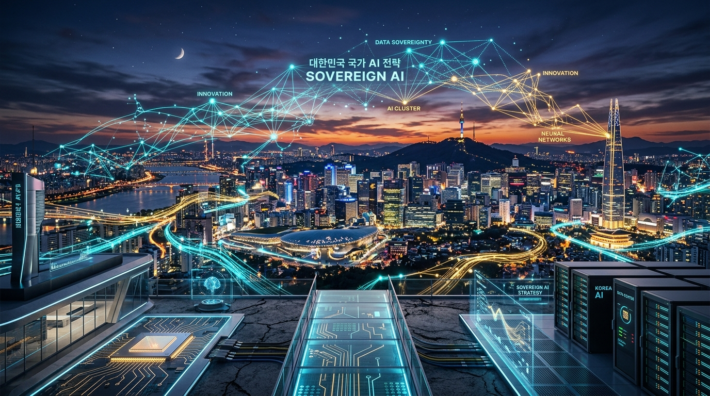
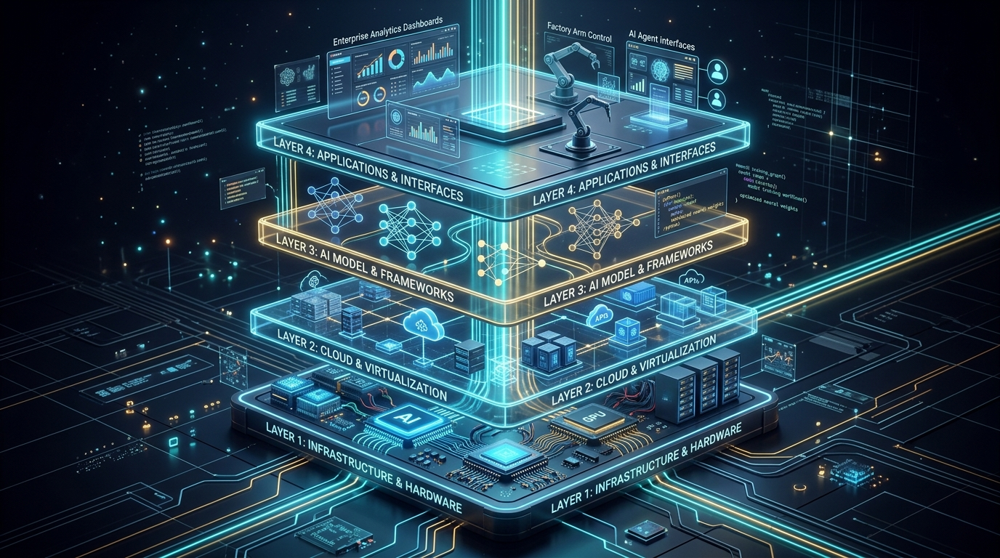
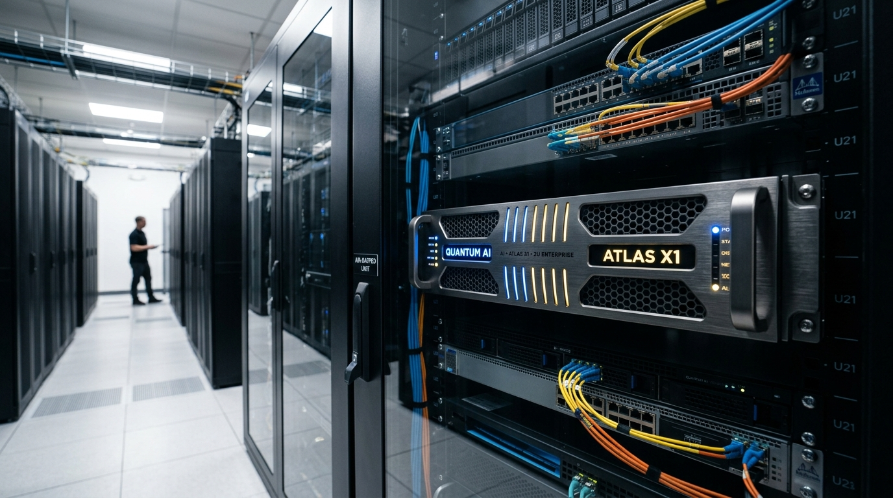
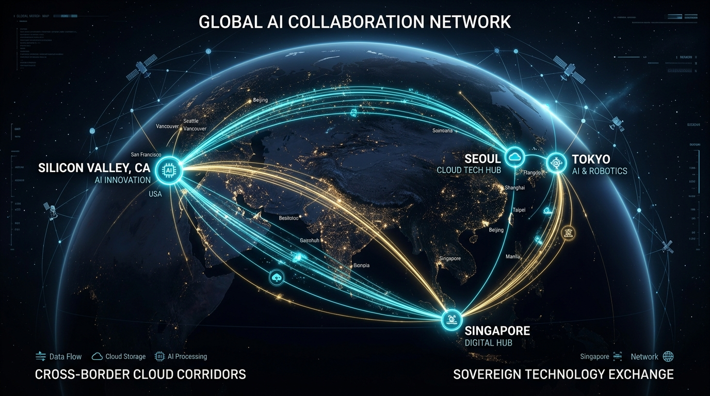

# 🇰🇷 Korea's Sovereign AI Strategy: From Silicon to Enterprise Applications
## Executive Presentation Deck for UCLA Anderson Executive MBA Delegation (Seoul Visit)

- **Date & Time**: Friday, September 11, 2026 | 10:00 – 11:30 AM KST
- **Venue**: Gwacheon HQ, 2F Grand Conference Room, MegazoneCloud
- **Audience**: UCLA Anderson Executive MBA (50 Delegates: 44 Executives + 6 Faculty/Staff)
- **Session**: Session 3 (20–30 min incl. Q&A | ~15 min core presentation)
- **Speaker**: Andy (ISV Business Unit & AI Architecture Group, MegazoneCloud)
- **Language**: English Only

---

## 📑 Slide Deck Master Index

| # | Section | Slide Title | Core Theme |
|---|---|---|---|
| **01** | Part 1: Context | Title & Welcome: Korea Sovereign AI Strategy | Executive Introduction |
| **02** | Part 1: Context | Welcome UCLA Anderson EMBA: Session Objectives & Agenda | Executive Briefing |
| **03** | Part 1: Context | The Geopolitics of AI: Why "Sovereignty" Matters in 2026 | Macro Paradigm Shift |
| **04** | Part 1: Context | South Korea’s Unique Position: The World’s 3rd AI Powerhouse | Global Benchmark |
| **05** | Part 1: Context | The Enterprise Trilemma: Capex, Power, and Data Sovereignty | Core Industry Pain Points |
| **06** | Part 1: Context | The 4-Pillar Framework: Infra, Model, Solution, and Service | Strategic Architecture |
| **07** | Part 2: Infra | National AI Computing Center: The Public-Private "AI Highway" | Public Mega-Project (Haenam) |
| **08** | Part 2: Infra | Compute Capacity Scaling: 15,000 GPUs (2028) to 50,000 (2030) | Scalable Infrastructure |
| **09** | Part 2: Infra | The Rise of K-NPU: The "K-Cloud" Initiative & NPU Farms | Semiconductor Sovereignty |
| **10** | Part 2: Infra | Korea’s Fabless Champions: Rebellions, FuriosaAI, DEEPX, Mobilint | Silicon Ecosystem |
| **11** | Part 2: Infra | Enterprise Hybrid Cloud & GPUaaS: Dell, NVIDIA, and Akamai | Hybrid Architecture |
| **12** | Part 2: Infra | Overcoming Data Center Bottlenecks: 10kW Rack Power & Cooling | Engineering Reality |
| **13** | Part 3: Model | Korea’s Foundation Model Landscape: HyperCLOVA X, EXAONE, Solar | Domestic LLM Capabilities |
| **14** | Part 3: Model | The Shift from Frontier Monoliths to Domain-Specific sLLM & MoE | Architecture Evolution |
| **15** | Part 3: Model | Cultural, Linguistic & Regulatory Alignment: The Sovereign Moat | Domain Precision |
| **16** | Part 3: Model | Model Optimization: INT4/NVFP4 Quantization & Pruning | Performance & Efficiency |
| **17** | Part 3: Model | Physical & Edge AI: Small Vision-Language-Action (VLA) Models | Robotics & Smart Infrastructure |
| **18** | Part 4: Solution | The Enterprise Missing Link: Why 85% of AI PoCs Stall | Enterprise Adoption Gap |
| **19** | Part 4: Solution | MegazoneCloud's 4-Layer Enterprise AI Full-Stack Architecture | Orchestration Platform |
| **20** | Part 4: Solution | Deep-Dive: From Nutanix/RHOAI (L2) to vLLM & Nota NetsPresso (L3) | Turnkey Stack |
| **21** | Part 4: Solution | Air-Gapped Security & Advanced Graph RAG (Mem0 + Graphify) | Zero-Exfiltration RAG |
| **22** | Part 4: Solution | The ISV Ecosystem: Orchestrating Global & Domestic Innovators | Multi-Vendor Synergy |
| **23** | Part 5: Service | Korea Inc. in Action: Enterprise AI Adoption Across Chaebols | Industry Deployment |
| **24** | Part 5: Service | Sovereign AI Turnkey Appliance: 1-Click On-Premises Deployment | Plug-and-Play Solution |
| **25** | Part 5: Service | Measurable Business ROI: 75% Capex Cut & 3.2kW Power Feasibility | Proven Case Studies |
| **26** | Part 5: Service | Public Sector & "AI for All Citizens": National Digital Transformation | Societal Impact |
| **27** | Part 6: MZC | MegazoneCloud’s Growth Story: From Cloud Pioneer to AI Unicorn | Corporate Journey |
| **28** | Part 6: MZC | Global Expansion Playbook: Bridging Korea, US, Japan & SE Asia | International Scaling |
| **29** | Part 6: MZC | Strategic Takeaways for Global Business Leaders | EMBA Key Insights |
| **30** | Part 6: MZC | Conclusion & Open Q&A Discussion | Collaborative Exchange |

---

# Part 1: Macro Context & Korea's Imperative (Slides 01 – 06)

---

### Slide 01: Title & Welcome
- **Headline**: Korea's Sovereign AI Strategy: From Silicon to Enterprise Applications
- **Subtitle**: Unlocking Strategic Autonomy, Native Infrastructure, and Scalable Enterprise Transformation
- **Event Callout**: Welcome UCLA Anderson Executive MBA Delegation to MegazoneCloud Gwacheon HQ
- **Presenter**: Andy | ISV Business Unit & AI Architecture Group, MegazoneCloud
- **Visual Graphic**:
  
- **Visual Concept**: Split visual featuring Seoul's futuristic smart skyline intertwined with neural network nodes, silicon wafer patterns (NPU/GPU), and enterprise datacenter racks.
- **Key Message**: South Korea is forging a unique, comprehensive Sovereign AI blueprint—not merely building domestic models, but orchestrating the entire value chain from custom silicon (NPU) to enterprise full-stack software.
- **Speaker Notes [0:00 - 0:30]**:
  > "Good morning, faculty, staff, and distinguished executives of the UCLA Anderson Executive MBA delegation. On behalf of MegazoneCloud, it is an immense privilege to welcome you to our Gwacheon Headquarters. Today, I am thrilled to share the inside story of South Korea’s Sovereign AI Strategy—how our nation is navigating the global AI race by building independent silicon, specialized models, and full-stack enterprise solutions."

---

### Slide 02: Welcome UCLA Anderson EMBA: Objectives & Agenda
- **Headline**: Today's 15-Minute Executive Briefing
- **Key Takeaways**:
  - Understand the geopolitical and economic drivers behind Korea's Sovereign AI imperative.
  - Explore the 4-Pillar Architecture: **Infra ➔ Model ➔ Solution ➔ Service**.
  - Discover how MegazoneCloud acts as the master orchestrator scaling domestic and global ISV ecosystems.
- **Audience Alignment**: Connecting to your Seoul immersion (Samsung, DEEPX, Amorepacific, Invest Seoul).
- **Agenda Breakdown**:
  1. *The Macro Driver*: Why Sovereign AI is a boardroom priority for 2026.
  2. *The 4 Pillars*: Deep dive into Infrastructure, Models, Software Solutions, and Enterprise Services.
  3. *MegazoneCloud's Playbook*: How Korea's #1 Cloud Unicorn scales AI domestically and globally.
- **Speaker Notes [0:30 - 1:00]**:
  > "As senior leaders from diverse industries across the United States and the globe, you are confronting AI transformation in your respective enterprises. Over the next 15 minutes, we will unpack why 'Sovereign AI' has shifted from a theoretical national policy into an urgent commercial reality—and how Korea is creating an actionable blueprint for enterprise autonomy."

---

### Slide 03: The Geopolitics of AI: Why "Sovereignty" Matters in 2026
- **Headline**: From 'AI Adoption' to 'Strategic Digital Autonomy'
- **Key Takeaways**:
  - Global AI duopoly risk: Heavy reliance on US hyperscalers creates vendor lock-in, latency bottlenecks, and regulatory vulnerabilities.
  - **Sovereign AI 2.0 Defined**: Not isolationism, but **Operational Sovereignty** and **Access Autonomy**—ensuring core industries can operate without external disruption.
  - Cross-Border Compliance: Tightening data protection laws (EU AI Act, Korea PIPA, Financial Cloud Guidelines).
- **Executive Comparison Matrix**:
  - *Commodity SaaS AI*: Black-box models, cloud data exfiltration risks, volatile API pricing, generic domain comprehension.
  - *Sovereign Enterprise AI*: 100% Air-gapped on-premise execution, proprietary data moat retention, deterministic cost structures, hyper-localized compliance.
- **Speaker Notes [1:00 - 1:30]**:
  > "In 2023 and 2024, the enterprise conversation was about 'Which commercial API is smartest?' In 2026, the executive question has radically shifted to: 'Who owns our intelligence assets? If cross-border connections are cut or foreign regulations change, can our business still operate?' This is the birth of Sovereign AI 2.0."

---

### Slide 04: South Korea’s Unique Position: The World’s 3rd AI Powerhouse
- **Headline**: One of Only Three Nations with an End-to-End Native AI Stack
- **Key Statistics**:
  - Global Stature: Alongside the United States and China, South Korea is one of the very few countries possessing:
    - 1. World-class semiconductor fabrication (Samsung, SK Hynix HBM).
    - 2. Native hyper-scale search engines and digital platforms (Naver, Kakao).
    - 3. Proprietary frontier-class foundation models (HyperCLOVA X, EXAONE, Solar).
    - 4. World-leading industrial conglomerates (Automotive, Defense, Shipbuilding, Battery, Consumer Tech).
- **The 'G3 Ambition'**: The Korean Ministry of Science and ICT (MSIT) and the Presidential National AI Committee have formally targeted global Top 3 AI leadership by 2027.
- **Speaker Notes [1:30 - 2:00]**:
  > "Why look at Korea? Because Korea has what few nations on Earth possess: the entire physical and digital vertical stack. We manufacture the High-Bandwidth Memory powering global GPUs; our domestic tech giants run search engines that compete head-to-head with Google; and our industrial titans demand mission-critical, zero-defect AI."

---

### Slide 05: The Enterprise Trilemma: Capex, Power, and Data Sovereignty
- **Headline**: The Real-World Friction Stalling Enterprise AI Deployments
- **The 3 Critical Roadblocks**:
  1. **Financial Barrier (Capex Shock)**: A single 8-GPU high-density server costs upwards of $400K–$500K with unpredictable delivery lead times.
  2. **Physical Infrastructure Barrier (Power & Cooling)**: Enterprise datacenter racks are typically capped at 8–10kW. An 8-GPU server draws 10.2kW peak, tripping legacy power systems.
  3. **Regulatory Barrier (Data Exfiltration)**: Defense, banking, and semiconductor manufacturing strictly forbid transmitting IP outside closed networks.
- **The Solution**: Compact, quantized sovereign architectures that deliver frontier intelligence within standard rack thresholds.
- **Speaker Notes [2:00 - 2:30]**:
  > "Every executive here knows the hype around generative AI. But when your CTO attempts to deploy a 250-billion parameter model on-premise, they hit a brick wall: 8-GPU servers that exceed datacenter power limits and cost a fortune. Solving this trilemma is the core mission of Korea's sovereign AI strategy."

---

### Slide 06: The 4-Pillar Framework: Infra, Model, Solution, Service
- **Headline**: The Architecture of National & Enterprise AI Independence
- **Visual Framework**:
  ```
  ┌─────────────────────────────────────────────────────────────────┐
  │  PILLAR 4: SERVICE (Enterprise Adoption & Industry Use Cases)   │
  │  Manufacturing, Finance, Defense, Public Sector, Global Scaling │
  ├─────────────────────────────────────────────────────────────────┤
  │  PILLAR 3: SOLUTION (Full-Stack Orchestration & Middleware)     │
  │  Nota NetsPresso, vLLM, Air-Gapped Graph RAG, Multi-Agent OS   │
  ├─────────────────────────────────────────────────────────────────┤
  │  PILLAR 2: MODEL (Sovereign sLLM, Frontier & MoE Architectures) │
  │  HyperCLOVA X, EXAONE 3.0, Solar Pro, Domain-Tuned Models      │
  ├─────────────────────────────────────────────────────────────────┤
  │  PILLAR 1: INFRASTRUCTURE (Compute, National Clouds & Silicon)  │
  │  National AI Computing Center, K-NPU (Rebellions, DEEPX), GPUaaS│
  └─────────────────────────────────────────────────────────────────┘
  ```
- **Strategic Insight**: Sovereignty fails if any layer is missing. Korea’s playbook coordinates all four layers synchronously.
- **Speaker Notes [2:30 - 3:00]**:
  > "To understand how Korea executes this, we must look at our 4-Pillar Framework: Infrastructure, Model, Solution, and Service. Today, we will examine how these four layers interconnect to deliver tangible business value."

---

# Part 2: Pillar 1 – Infrastructure & Silicon Sovereignty (Slides 07 – 12)

---

### Slide 07: National AI Computing Center: The Public-Private "AI Highway"
- **Headline**: A Multi-Billion Dollar Sovereign Compute Megaproject
- **Visual Graphic**:
  
- **Key Highlights**:
  - **Location & Scale**: Officially broken ground in August 2026 at the Solaseado Datacenter Park in Haenam, South Jeolla Province.
  - **Public-Private Partnership (PPP)**: Jointly spearheaded by MSIT, local governments, and a private consortium led by Samsung SDS via a dedicated Special Purpose Company (SPC).
  - **Core Purpose**: Serving as the national "AI Highway," providing subsidized, ultra-high-performance compute clusters to domestic enterprises, research universities, and AI startups.
- **Strategic Significance**: Ensuring Korean industry never suffers from global GPU allocation shortfalls during geopolitical crises.
- **Speaker Notes [3:00 - 3:30]**:
  > "Pillar 1 begins with compute sovereignty. Just last month, in August 2026, the South Korean government broke ground on the National AI Computing Center in Haenam. This is a massive public-private partnership ensuring that Korean enterprises and researchers have direct, uninterrupted access to top-tier compute."

---

### Slide 08: Compute Capacity Scaling: 15,000 GPUs to 50,000 GPUs
- **Headline**: The Exponential Trajectory of Korea's Public Compute Infrastructure
- **Phase Breakdown**:
  - **Phase 1 (2026 – 2028)**: Deployment of **15,000 cutting-edge GPUs** (NVIDIA H100/B200 tier) with direct multi-terabit optical interconnects.
  - **Phase 2 (2029 – 2030+)**: Scaling to **50,000+ AI accelerators**, integrating renewable coastal wind power and next-generation liquid cooling.
- **Economic Model**:
  - Tiered resource allocation for public interest vs. commercial innovation.
  - Sovereign cloud access vouchers for emerging high-growth tech firms.
- **Speaker Notes [3:30 - 4:00]**:
  > "The roadmap is ambitious and pragmatic: reaching 15,000 state-of-the-art accelerators by 2028, and expanding to over 50,000 by 2030. This creates an unassailable sovereign compute bedrock that cushions our domestic economy against international GPU price shocks."

---

### Slide 09: The Rise of K-NPU: The "K-Cloud" Initiative & NPU Farms
- **Headline**: Diversifying Beyond GPU Monopolies via Domestic Neural Processing Units
- **The K-Cloud Roadmap**:
  - MSIT-backed national initiative with a multi-year budget exceeding $600 Million.
  - Focus: Replacing energy-hungry GPUs with hyper-efficient domestic NPUs specifically for **AI Inference** workloads.
- **NPU Farm Deployments**:
  - Large-scale clusters established in Gwangju AI Cluster and major domestic CSPs (Naver Cloud, KT Cloud, NHN Cloud).
  - Transitioning from government-mandated quotas to **market-driven, benchmark-validated enterprise adoption**.
- **Speaker Notes [4:00 - 4:30]**:
  > "While training foundation models requires massive GPU clusters, up to 80% of ongoing enterprise lifecycle costs stem from inference. This is where Korea's K-Cloud project comes in: deploying native Neural Processing Units that consume a fraction of the power of traditional GPUs."

---

### Slide 10: Korea’s Fabless Champions: Rebellions, FuriosaAI, DEEPX, Mobilint
- **Headline**: The Next Generation of Global Silicon Innovators
- **Ecosystem Map**:
  - **Rebellions (ATOM / ATOM-MAX)**: Optimized for datacenters, financial algorithmic trading, and hyper-scale vision/sLLM inference.
  - **FuriosaAI (WARBOY / RENEGADE)**: Specialized in high-throughput computer vision and Transformer architectures with FP8 support.
  - **DEEPX (All-in-4 AI Chip Series)**: *Special welcome to DEEPX on UCLA Anderson's itinerary!* Pioneer in ultra-low power on-device edge NPU for robotics, IoT, and smart mobility.
  - **Mobilint (ARIES / REGULUS)**: Industrial automation and edge vision computing.
- **Key Takeaway**: Korea is building silicon diversity across Datacenter, Edge, and On-Device form factors.
- **Speaker Notes [4:30 - 5:00]**:
  > "Many of you have DEEPX on your official visiting itinerary this week. DEEPX, along with Rebellions and FuriosaAI, represent the vanguard of Korea's fabless revolution. Instead of trying to mimic monolithic GPUs, they are engineering purpose-built silicon that wins on inference TCO and energy efficiency."

---

### Slide 11: Enterprise Hybrid Cloud & GPUaaS: Dell, NVIDIA, and Akamai
- **Headline**: Balancing Tier-1 Global Standards with Modular Sovereign Clouds
- **The Dual-Track Infrastructure Strategy**:
  - **Track A (Mainstream Enterprise)**: Dell PowerEdge R760/XE9680 servers + NVIDIA H100/H200 GPUs. MegazoneCloud acts as a premier partner delivering certified reference architectures.
  - **Track B (Cost-Optimized GPUaaS)**: Akamai Distributed Cloud + NVIDIA GPUaaS partnerships, enabling sub-millisecond edge inferencing at 40% lower egress costs.
- **Sovereign Hybrid Topology**:
  - Sensitive core intellectual property executed 100% on-premises.
  - Burst inference and external interactions scaled across secure sovereign cloud nodes.
- **Speaker Notes [5:00 - 5:30]**:
  > "Sovereignty does not mean closing our doors to global tech. On the contrary: MegazoneCloud delivers certified Dell and NVIDIA enterprise architectures, while simultaneously pioneering distributed GPUaaS with partners like Akamai to optimize TCO for our corporate clients."

---

### Slide 12: Overcoming Data Center Bottlenecks: 10kW Rack Power & Cooling
- **Headline**: Solving the Physical Engineering Crisis in Enterprise Server Rooms
- **The Challenge**:
  - 90% of legacy corporate datacenters in Seoul have 8kW–10kW maximum rack power allocations.
  - Liquid cooling retrofits cost millions and require months of construction downtime.
- **The Engineering Breakthrough**:
  - 2-GPU Dense Form Factor (Dell R760 2U) replacing legacy 8-GPU 4U/8U chassis.
  - Operating power: **Capped at 3.2kW**, easily fitting within standard enterprise racks without electrical facility retrofitting.
- **Speaker Notes [5:30 - 6:00]**:
  > "Here is the unglamorous reality of enterprise AI: your electrical breaker trips. By pairing optimized software with dual-GPU 2U servers, we bring consumption down from 10.2kW to 3.2kW. That means an enterprise can deploy sovereign AI in their existing server room tomorrow morning without calling the power utility."

---

# Part 3: Pillar 2 – Foundation Models & Domain Specialization (Slides 13 – 17)

---

### Slide 13: Korea’s Foundation Model Landscape
- **Headline**: Native Linguistic Mastery and Enterprise Frontier AI
- **The Big 3 Korean Foundation Models**:
  1. **Naver HyperCLOVA X**: The dominant commercial hyper-scale model, trained on 6,500x more Korean data than GPT-3, deeply embedded in Korean e-commerce and public services.
  2. **LG AI Research EXAONE 3.0**: Bilingual open-weight foundation model engineered for industrial, chemical, biomedical, and patent applications.
  3. **Upstage Solar / Solar Pro**: Globally recognized top-performing sLLM on HuggingFace, pioneering Depth-Up Scaling (DUS).
- **Speaker Notes [6:00 - 6:30]**:
  > "Turning to Pillar 2: Models. Korea does not rely solely on translated foreign LLMs. Naver's HyperCLOVA X, LG's EXAONE, and Upstage's Solar are engineered natively with deep Korean cultural, legal, and linguistic understanding, delivering accuracy rates that foreign models cannot match in domestic context."

---

### Slide 14: The Shift from Frontier Monoliths to Domain-Specific sLLM & MoE
- **Headline**: Why Smaller, Specialized Models are Winning the Enterprise War
- **The Demise of the "One-Size-Fits-All" Paradigm**:
  - Monolithic 1-Trillion parameter models are too slow, too expensive, and unmaintainable on private infrastructure.
  - **Mixture-of-Experts (MoE) Revolution**: Activating only 20B–30B active parameters out of 250B total parameters per token.
- **Enterprise Advantages of Domain sLLMs**:
  - Tailored to proprietary ERP, CAD, legal, and financial taxonomies.
  - Deterministic latency (<50ms first-token response).
  - Complete air-gapped lifecycle ownership.
- **Speaker Notes [6:30 - 7:00]**:
  > "Global tech headlines focus on trillion-parameter models. But enterprise CFOs focus on cost per transaction. The true winner in corporate adoption is the domain-specific sLLM and Mixture-of-Experts architecture: activating only the parameters needed for the specific business task."

---

### Slide 15: Cultural, Linguistic & Regulatory Alignment: The Sovereign Moat
- **Headline**: The High Cost of Cultural and Regulatory Hallucination
- **Why Generic Global Models Fail in Korean Enterprise**:
  - **Honorific & Hierarchical Nuance**: Business Korean requires precise contextual politeness (Jondaetmal); errors can insult clients or executives.
  - **Legal & Accounting Standards**: Korean GAAP, Commercial Code, and Labor Standards Act require exact citation without creative paraphrasing.
  - **Regulatory Compliance**: Financial Services Commission (FSC) cloud network separation mandates strict data sovereignty.
- **The Sovereign Moat**: High-precision localized models achieve 99.2% compliance verification vs. ~71% for off-the-shelf global APIs.
- **Speaker Notes [7:00 - 7:30]**:
  > "In Korean corporate culture, a misplaced honorific can derail a multi-million-dollar partnership. Global models often translate English idioms into awkward or culturally inappropriate phrasing. A sovereign model acts as a culturally fluent corporate employee."

---

### Slide 16: Model Optimization: INT4/NVFP4 Quantization & Pruning
- **Headline**: Compressing Frontier Intelligence into Workstation Form Factors
- **Technical Breakdown**:
  - **Quantization**: Converting 16-bit floating-point weights (FP16) down to INT4 and NVFP4 (NVIDIA Floating Point 4) with under 1.5% perplexity degradation.
  - **Non-Uniform Pruning**: Removing redundant attention heads and MLP layers specifically for target enterprise domains.
- **The Direct Financial Impact**:
  - Memory footprint slashed by **70%**.
  - Token throughput boosted from 18 tokens/sec to **65+ tokens/sec** on a single dual-GPU server.
- **Speaker Notes [7:30 - 8:00]**:
  > "How do we fit massive models into compact servers? Through aggressive, loss-less quantization. By working with cutting-edge software compilers, we compress weights from FP16 down to INT4, tripling token throughput while preserving analytical reasoning."

---

### Slide 17: Physical & Edge AI: Small Vision-Language-Action (VLA) Models
- **Headline**: Extending Sovereign Intelligence to the Physical World
- **Bridging Digital AI and Industrial Operations**:
  - **SmolVLA & Compact Multi-modal Models**: Enabling robotic arms, AGVs (Automated Guided Vehicles), and smart factory cameras to reason in real time.
  - **Smart City & Intelligent Transport Systems (ITS)**: Nota.ai's edge traffic controllers deployed across Daejeon City (200 intersections) and Dubai RTA, performing real-time signal optimization at 30 FPS.
- **Strategic Fit**: Connecting software intelligence directly with Korea’s powerhouse manufacturing and robotics sectors.
- **Speaker Notes [8:00 - 8:30]**:
  > "Sovereign AI is not trapped inside a chatbot. It operates on the factory floor and at city intersections. By deploying Small Vision-Language-Action models directly onto edge devices, we enable autonomous robotics and intelligent traffic systems that function without cloud latency."

---

# Part 4: Pillar 3 – Solutions & Full-Stack Orchestration (Slides 18 – 22)

---

### Slide 18: The Enterprise Missing Link: Why 85% of AI PoCs Stall
- **Headline**: The Chasm Between "Toy Chatbots" and "Production Workflows"
- **The 4 Fatal Missing Links**:
  1. **Hardware Misalignment**: Models built on cloud clusters cannot run on existing enterprise server infrastructure.
  2. **Data Integration Friction**: Corporate data sits in legacy silos, unstructured PDFs, and fragmented databases.
  3. **Compliance & Guardrail Void**: Lack of enterprise-grade hallucination gates, audit logs, and PII filters.
  4. **Vendor Fragmentation**: Enterprises are exhausted from juggling 10 different startups for chips, models, databases, and UI.
- **Speaker Notes [8:30 - 9:00]**:
  > "Industry studies show that 85% of enterprise AI proofs-of-concept never reach production. Why? Because assembling models, vector databases, server hardware, and security guardrails from fragmented vendors creates an administrative nightmare. This is the 'Missing Link' MegazoneCloud solves."

---

### Slide 19: MegazoneCloud's 4-Layer Enterprise AI Full-Stack Architecture
- **Headline**: The Standardized, Modular Operating Blueprint for Enterprise AI
- **Visual Graphic**:
  
- **The 4-Layer Stack Overview**:
  ```
  ┌─────────────────────────────────────────────────────────────────┐
  │ LAYER 4: Enterprise Applications (RAG, Coding Agent, Analytics) │
  ├─────────────────────────────────────────────────────────────────┤
  │ LAYER 3: Model Optimization & Serving (Nota NetsPresso, vLLM)   │
  ├─────────────────────────────────────────────────────────────────┤
  │ LAYER 2: Platform & Orchestration (Red Hat OpenShift AI, Nutanix│
  ├─────────────────────────────────────────────────────────────────┤
  │ LAYER 1: Hardware & Infrastructure (Dell PowerEdge, NVIDIA/NPU) │
  └─────────────────────────────────────────────────────────────────┘
  ```
- **The Value Proposition**: Turnkey, vendor-agnostic, and fully supported under a single enterprise SLA.
- **Speaker Notes [9:00 - 9:30]**:
  > "MegazoneCloud designed the 4-Layer Enterprise AI Full-Stack Framework. It unifies certified hardware from Dell, virtualization from Nutanix and Red Hat, model optimization from Nota, and enterprise applications into an integrated, single-SLA solution."

---

### Slide 20: Deep-Dive: From Nutanix/RHOAI (L2) to vLLM & Nota (L3)
- **Headline**: The Engine Room of Low-Latency, High-Density Model Serving
- **Layer 2 (Platform)**:
  - **Nutanix Cloud Infrastructure (NCI)** & **Red Hat OpenShift AI (RHOAI)**: Providing single-pane-of-glass Kubernetes orchestration, automated failover, and GPU resource slicing (vGPU).
- **Layer 3 (Serving & Optimization)**:
  - **Nota NetsPresso**: Automated model profiling, hardware-aware compression, and automated compiler graph optimization.
  - **vLLM & Triton Inference Server**: Continuous batching, PagedAttention, and sub-second multi-tenant routing.
- **Speaker Notes [9:30 - 10:00]**:
  > "At Layers 2 and 3, we solve the efficiency puzzle. Nutanix and OpenShift AI virtualize GPU resources across business units, while Nota's NetsPresso and vLLM maximize inference density. The result is maximum throughput from minimum hardware investment."

---

### Slide 21: Air-Gapped Security & Advanced Graph RAG (Mem0 + Graphify)
- **Headline**: True Data Moats: Zero Exfiltration Meets Deep Context
- **Zero-Trust Sovereign Security**:
  - Complete physical isolation (Air-Gapped) for defense, financial core banking, and fab process engineering.
  - Local cryptographic key management with hardware security modules (HSM).
- **Next-Gen Retrieval-Augmented Generation**:
  - **Mem0 Context Layer**: Persistent multi-session memory tracking user roles and permissions.
  - **Graphify AST RAG**: Abstract Syntax Tree knowledge graphing for deep semantic code and structured document parsing.
- **Speaker Notes [10:00 - 10:30]**:
  > "For our defense and financial clients, cloud APIs are legally forbidden. We build air-gapped systems where not a single byte escapes the corporate firewall. Furthermore, by pairing Mem0 memory architectures with Graphify knowledge graphs, our systems understand complex corporate context without hallucinating."

---

### Slide 22: The ISV Ecosystem: Orchestrating Global & Domestic Innovators
- **Headline**: The Power of the MegazoneCloud ISV Aggregator Model
- **Collaborative Ecosystem Map**:
  - **Global Category Leaders**:
    - **Articul8**: Enterprise generative AI platform with autonomous full-stack orchestration.
    - **Cohere**: Frontier multilingual embeddings and enterprise search reranking.
  - **Domestic Specialist Champions**:
    - **Nota.ai**: World-class AI optimization engine and intelligent transport solutions.
    - **PuzzleData (ProDiscovery)**: Process mining integration for automated business process discovery.
    - **QuantumAI**: Air-gapped speech-to-text (STT) and conversational contact center agents.
- **Speaker Notes [10:30 - 11:00]**:
  > "MegazoneCloud does not believe in building everything in-house. We curate and orchestrate the world's best ISVs. Whether integrating Silicon Valley's Articul8 and Cohere or domestic innovators like Nota and PuzzleData, we give our enterprise customers an interoperable, best-of-breed ecosystem."

---

# Part 5: Pillar 4 – Service & Enterprise Adoption in Korea (Slides 23 – 26)

---

### Slide 23: Korea Inc. in Action: Enterprise AI Adoption Across Chaebols
- **Headline**: How South Korea's Industrial Giants Are Deploying Sovereign AI
- **Cross-Industry Deployments**:
  - **High-Tech Manufacturing & Semiconductor**: Visual defect inspection, fab yield prediction, automated wafer defect classification.
  - **Financial Services**: Sovereign fraud detection, automated credit risk evaluation, and private RAG for financial analyst research.
  - **Automotive & Heavy Industry**: Predictive maintenance across automated assembly lines, CAD design copilot for engineering teams.
  - **Consumer Goods & Beauty (e.g., Amorepacific context)**: Hyper-personalized skincare recommendation engines operating in compliance with global PII regulations.
- **Speaker Notes [11:00 - 11:30]**:
  > "Korea Inc. is moving with breathtaking speed. In semiconductor manufacturing, AI inspects micro-defects at line speed. In banking, private LLMs parse regulatory filings in seconds. And in consumer goods, personalized beauty algorithms operate locally, keeping customer biometrics strictly confidential."

---

### Slide 24: Sovereign AI Turnkey Appliance: 1-Click On-Premises Deployment
- **Headline**: Delivering Enterprise AI as a Pre-Integrated, Plug-and-Play Appliance
- **Visual Graphic**:
  
- **The Turnkey Experience**:
  - Pre-racked, pre-cabled, pre-flashed with certified Linux, Kubernetes, and LLM stacks.
  - Power-on to first internal query in **less than 2 hours** (compared to traditional 6-month consulting engagements).
- **Core Specifications**:
  - Chassis: Dell PowerEdge R760 2U Dual-Socket.
  - Compute: 2x NVIDIA H100 NVL or Certified Domestic NPU.
  - Stack: Nutanix AHV + Nota NetsPresso INT4 + Sovereign Domain MoE LLM.
- **Speaker Notes [11:30 - 12:00]**:
  > "To make sovereign AI accessible to mid-market and enterprise clients alike, we created the Sovereign AI Turnkey Appliance. It arrives pre-integrated in a 2U box. You plug it into power and network, and within two hours, your company has a private, air-gapped AI operating at enterprise speed."

---

### Slide 25: Measurable Business ROI: 75% Capex Cut & 3.2kW Power Feasibility
- **Headline**: The Hard Financial and Operational Metrics of Success
- **Comparative Financial Case Study**:
  | Metric | Standard 8-GPU Cloud/On-Prem Stack | MegazoneCloud Sovereign 2-GPU Stack | Impact / Savings |
  |---|---|---|---|
  | **Hardware Capex** | ~$480,000 USD (per cluster) | **~$120,000 USD** | **75% Capex Reduction** |
  | **Peak Power Draw** | 10.2 kW (Exceeds rack limit) | **3.2 kW (Standard rack fit)** | **No Datacenter Retrofit** |
  | **Inference Latency** | Variable (120ms – 400ms) | **42ms (Guaranteed Deterministic)**| **3x Faster Response** |
  | **Data Risk Exposure**| External egress vulnerable | **0 Bytes External Transmission** | **100% Sovereign Moat** |
- **Speaker Notes [12:00 - 12:30]**:
  > "Here are the metrics that matter to the C-suite: 75% reduction in initial capital expenditure, 3.2kW power feasibility that eliminates datacenter rewiring, and sub-50ms deterministic latency—with zero risk of proprietary data leaks."

---

### Slide 26: Public Sector & "AI for All Citizens": National Digital Transformation
- **Headline**: Democratizing AI Across Civil Service, Healthcare, and Education
- **National Policy Goals**:
  - **AI Civil Servants**: Automating repetitive administrative documentation and municipal citizen inquiries.
  - **Universal AI Vouchers**: Providing small-and-medium enterprises (SMEs) with subsidized access to sovereign AI compute.
  - **Regional Equity**: Deploying AI diagnostics across rural public health clinics to bridge medical accessibility gaps.
- **Social Impact**: Ensuring the economic benefits of the AI revolution are shared across all sectors of society.
- **Speaker Notes [12:30 - 13:00]**:
  > "Pillar 4 extends beyond corporate balance sheets into national welfare. The Korean government's 'AI for All' initiative integrates sovereign models into municipal services, rural healthcare diagnostics, and public education, ensuring that digital equity accompanies technological acceleration."

---

# Part 6: MegazoneCloud's Playbook & Global Vision (Slides 27 – 30)

---

### Slide 27: MegazoneCloud’s Growth Story: From Cloud Pioneer to AI Unicorn
- **Headline**: The Architect Behind Korea’s Cloud and AI Revolutions
- **The Megazone Journey**:
  - **1998**: Founded as an early digital pioneer.
  - **2012**: Became the first official AWS Premier Consulting Partner in South Korea.
  - **2022**: Achieved official **Unicorn Status** (valuation exceeding $1.8B USD).
  - **2026**: Transforming from Korea’s #1 Cloud MSP into the premier **Global AI Full-Stack Enabler & Solution Orchestrator**.
- **Scale at a Glance**: Over 2,700 enterprise clients, 1,500+ cloud and AI specialists, and global offices across the US, Japan, Singapore, and Europe.
- **Speaker Notes [13:00 - 13:30]**:
  > "For those newer to our story: MegazoneCloud pioneered cloud computing in Korea over a decade ago as the country's first AWS Premier Partner. Today, as a multi-billion dollar tech unicorn, we are leveraging that exact operational pedigree to lead the AI transformation era."

---

### Slide 28: Global Expansion Playbook: Bridging Korea, US, Japan & SE Asia
- **Headline**: Taking Korea’s Sovereign AI Expertise to International Markets
- **Visual Graphic**:
  
- **The Global Playbook**:
  - **United States (Silicon Valley / Palo Alto)**: Sourcing frontier AI technologies, venture partnerships, and enterprise co-development.
  - **Japan (Tokyo)**: Expanding sovereign AI full-stack offerings to Japanese financial, manufacturing, and gaming leaders facing similar data localization rules.
  - **Southeast Asia (Singapore, Vietnam)**: Deploying localized, cost-effective NPU inference appliances and cloud management software (SpaceONE).
- **The Value Proposition**: A trusted bridge connecting Western tech innovation with Asian enterprise execution.
- **Speaker Notes [13:30 - 14:00]**:
  > "Our growth strategy is inherently international. Through our offices in the US, Japan, and Southeast Asia, we export the sovereign AI methodologies we perfected in Korea. We help enterprises across the Asia-Pacific region achieve operational sovereignty while maintaining deep ties to global tech ecosystems."

---

### Slide 29: Strategic Takeaways for Global Business Leaders
- **Headline**: Key Lessons from Korea’s Sovereign AI Playbook for UCLA Anderson EMBA
- **Executive Lessons**:
  1. **Don't Conflate Sovereignty with Isolation**: Real sovereignty comes from orchestrating global standards with local execution control.
  2. **Attack the TCO and Physics First**: Compute physics (power, cooling, rack space) will dictate your AI strategy faster than boardroom ambition.
  3. **Own Your Proprietary Moat**: Treat domain data, internal workflows, and corporate knowledge graphs as core balance sheet assets.
  4. **Embrace Multi-Layer Agility**: Avoid vendor lock-in by designing modular architectures that decouple silicon, models, and platforms.
- **Speaker Notes [14:00 - 14:30]**:
  > "As executive leaders returning to your organizations, consider these four principles: true sovereignty is about operational agility, not building walls. Focus on physical datacenter constraints early. Guard your proprietary knowledge graphs fiercely. And build modular systems that allow you to swap chips and models as the market evolves."

---

### Slide 30: Conclusion & Open Q&A Discussion
- **Headline**: Shaping the Future of Enterprise AI Together
- **Summary Visual**: Collaborative handshake between global enterprise strategy (UCLA Anderson) and Asian technological execution (MegazoneCloud).
- **Speaker Details**:
  - **Speaker**: Andy | ISV Business Unit & AI Architecture Group, MegazoneCloud
  - **Email**: andy@megazone.com | contact@megazone.com
  - **Headquarters**: MegazoneCloud Gwacheon Smart Tower, Gwacheon-si, Gyeonggi-do, Korea
- **Open Floor Discussion Topics**:
  - Comparative regulatory policies: US vs. Korea vs. EU.
  - The future of NPU vs. GPU economics in enterprise data centers.
  - Best practices for scaling sovereign AI across multinational subsidiaries.
- **Speaker Notes [14:30 - 15:00]**:
  > "Thank you immensely for your time, attention, and leadership. We believe the future of enterprise AI will be defined by strategic autonomy, architectural elegance, and global collaboration. The floor is now open, and I look forward to your questions and insights."

---
*End of 30-Slide Master Deck Specification.*
