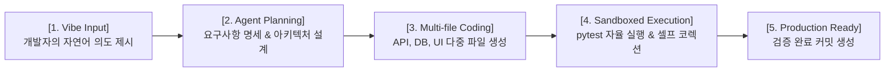

# 🚀 Enterprise Coding Agent OS (with Vibe Coding Platform)

> **"의도(Vibe)만 제시하면, 코드 작성부터 샌드박스 검증까지 자율 완성하는 엔터프라이즈 AI 코딩 에이전트"**

본 프로젝트는 10월 Red Hat Summit 및 11월 Intel AI Summit 행사에서의 라이브 부스 전시, 사내 AI 기술력 홍보, 그리고 오픈소스 커뮤니티 공개를 목표로 구축되는 **엔터프라이즈 지향 자율형 코딩 에이전트 솔루션**입니다.

---

## 🎯 1. 프로젝트 기본 취지 및 핵심 목적

1. **Vibe Coding (바이브 코딩) 패러다임 구현**:
   - 개발자가 복잡한 구문(Syntax)이나 보일러플레이트 코드 작성에 시간을 소모하지 않고, 자연어 수준의 아이디어와 도메인 의도("Vibe")를 전달하면 AI가 전 과정을 완성.
2. **Desktop-First ➔ Cloud ➔ On-Premise 단계별 이식성**:
   - 개발자의 로컬 데스크톱 환경에서 신속히 1차 동작 버전을 완성한 후, 구글 클라우드(GCP) 및 Red Hat OpenShift AI(SNO) 폐쇄망 환경으로 확산 배포.
3. **100% Air-Gapped 보안 완결성**:
   - Cursor나 Claude Code 등 기존 상용 SaaS가 제공하지 못하는 단 1바이트의 유출도 없는 온프레미스 보안 제공.

---

## 💡 2. Vibe Coding (바이브 코딩)이란?

### 📖 Vibe Coding의 정의
> **Vibe Coding(바이브 코딩)**이란 개발자가 세부적인 구현 코드 문법이나 라이브러리 보일러플레이트에 얽매이지 않고, **자연어 수준의 비즈니스 의도, 디자인 감성, 고차원적 기능 컨셉("Vibe")**을 에이전트에게 제시하면, 에이전트가 요구사항 명세화 ➔ 아키텍처 설계 ➔ 다중 파일 동시 작성 ➔ 샌드박스 자동 빌드/테스트 ➔ 에러 셀프코렉션(Self-Correction)까지 자율적으로 전 과정을 완성해내는 **'의도 중심 자율 개발 패러다임 (Intent-Driven Autonomous Coding)'**입니다.



---

## 🏗️ 3. 시스템 3단계 배포 로드맵 (Deployment Strategy)

| 배포 단계 | 인프라 환경 | 주요 특징 및 역할 |
| :--- | :--- | :--- |
| **Stage 1 (Desktop First)** | 로컬 데스크톱 / 개발자 워크스테이션 | **[현재 진행 단계]** 로컬 Docker/Python 환경에서 동작하는 1차 Desktop Agent Runner 완성 |
| **Stage 2 (GCP Cloud)** | Google Cloud Platform (GCP) | OpenRouter API 및 멀티 테넌트 개발자 샌드박스 운용 (개발 인프라 비용 극대화 절감) |
| **Stage 3 (On-Premise)** | Red Hat OpenShift AI (SNO) | 100% 온프레미스 폐쇄망 vLLM (Qwen2.5-Coder) 엔드포인트 1-Click 포팅 및 행사 시연 |

---

## 🛡️ 4. 개발 가드레일 (Plan-Code-Doc 트라이어드 수칙)

본 프로젝트의 모든 기능 개발은 **작업 트라이어드 수칙**에 따라 다음 3가지 파일이 1:1:1로 반사 생성되어야 Git 머지(Merge)가 가능합니다:
1. **[작업계획서]**: `mvp/coding-agent/docs/plans/feature_name_plan.md`
2. **[개발된 코드]**: `mvp/coding-agent/src/...`
3. **[상세명세서]**: `mvp/coding-agent/docs/specs/feature_name_spec.md`

---

## 🌿 5. Git 브랜치 체계

- `main`: 온프레미스 및 클라우드 배포용 안정 브랜치 (Protected)
- `staging`: GCP / 데스크톱 통합 테스트 및 검증 브랜치
- `feature/*`: 단위 기능 개발 브랜치 (예: `feature/vibe-coding-engine`, `feature/mcp-router`)

---

## 📁 6. 프로젝트 디렉터리 구조

```
aifullstack/
├── AGENTS.md                  # 프로젝트 전역 규칙 및 가드레일
├── README.md                  # 프로젝트 메인 안내서 (본 문서)
├── docs/                      # 기술 규격서 & 분석 보고서 (HTML 표준)
│   ├── index.html             # 문서 통합 포털 사이트
│   ├── coding_agent_basic_design.html   # 기본설계서 & 상세설계서
│   ├── coding_agent_top3_analysis.html  # 글로벌 TOP 3 분석 보고서
│   └── IDEATION/              # 아이디어 백업 마크다운 폴더
├── proposal/                  # 제안서 & UI/UX 목업 (HTML)
│   ├── index.html             # 제안서 통합 포털 사이트
│   ├── coding_agent_ui_mockup.html      # 코딩 에이전트 대시보드 UI 초안
│   └── exhibition_pilot_solution_proposal.html  # 10월/11월 행사 시연 제안서
└── mvp/coding-agent/          # 코딩 에이전트 MVP 시연 소스코드
    ├── README.md              # MVP 상세 실행 안내서
    └── TODO.md                # 단계별 구현 과제 로드맵
```

---

© 2026 AI Architecture Engineering Team. All rights reserved.
