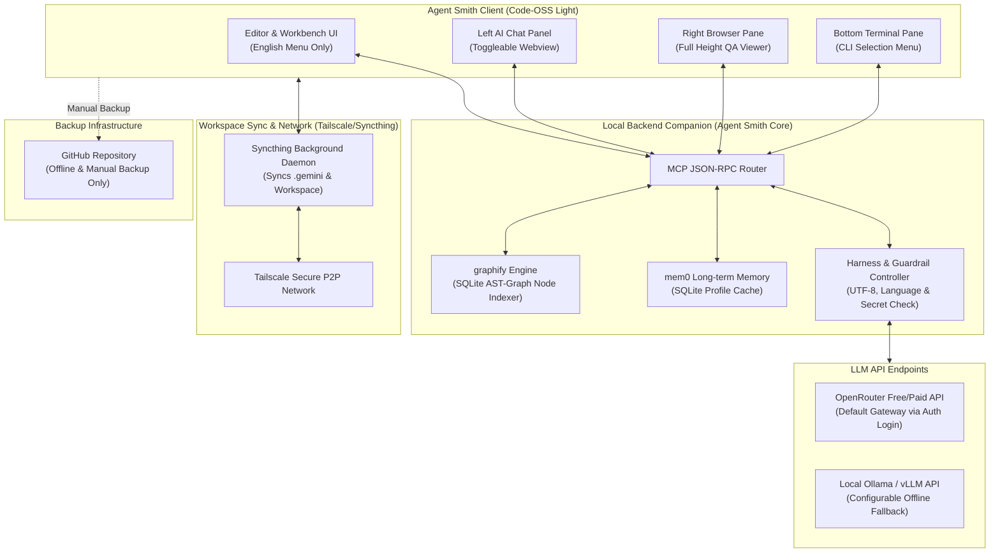

# Agent Smith IDE 기초 설계서 & 상세설계서 (Basic & Detailed Design Specification)

본 문서는 VS Code(Code - OSS)를 커스텀 포크하여 개발되는 초경량 지능형 AI 에디터 **Agent Smith**의 아키텍처 기초 설계서 및 상세 설계서입니다.

---

## 1. 시스템 개요 및 아키텍처 설계

**Agent Smith**는 기존의 무겁고 클라우드 의존적인 AI IDE(Cursor, Windsurf 등)와 달리, 사용자의 로컬 자원을 극도로 아끼고 사내 보안성(Air-gapped 호환)을 보장하는 **초경량 로컬 중심 AI 에디터**입니다.



---

## 2. 핵심 세부 컴포넌트 상세 설계

### 2.1 P2P 동기화 및 오프라인 백업 (Tailscale & Syncthing)
* **목적**: 깃허브가 차단되었거나 오프라인인 환경에서도 사용자의 개인 설정 파일과 작업 워크스페이스를 실시간 동기화하여 멀티 디바이스 환경에서 작업 연속성을 보장합니다.
* **Syncthing 가동 정책**:
  - 사용자 설정 디렉터리(`C:/Users/<Username>/.gemini`)와 프로젝트 워크스페이스를 Syncthing 데몬이 감시.
  - 기기 변경 발생 시 델타 동기화(Delta Sync)를 수행하여 백그라운드 데이터 일치 보장.
* **Tailscale 사설 통신**:
  - 공인 IP가 없거나 방화벽이 있는 환경에서도 Tailscale P2P VPN 터널링을 통해 동기화 트래픽 및 AI 대화 공유 데이터를 암호화 전송.
* **GitHub의 역할**:
  - 실시간 코드 공유용이 아닌 최종 빌드 및 오프라인 백업 저장소로 활용.

### 2.2 온디맨드 UI 토글 & 풀하이트 레이아웃 (On-Demand UI)
* **최적화 규칙**: 기본 VS Code 벤치와 마찬가지로 에디터 기동 시 RAM 점유율을 150MB 이하로 유지하기 위해 AI 챗, 브라우저 등의 무거운 웹뷰 패널은 비활성 상태로 기동됩니다.
* **우측 브라우저(QA Sub-Agent)**: 에디터 우측 전체 높이(Full Height)로 동작하여 모바일/웹 뷰포트 레이아웃 검증 시 왜곡 없는 결과물을 시각화합니다.
* **하단 터미널**: 브라우저 하단을 제외한 좌측 Chat Panel과 중앙 Editor 아래에만 배치되어 최대화/축소 토글이 가능합니다.

### 2.3 `graphify` + `mem0` 지능형 토큰 세이빙
* **`graphify` (AST 분석)**:
  - 파일 로딩 시 코드 구조 분석 도구가 프로젝트 내 의존 관계(Class, Function, Imports)의 유기적 호출 맵을 SQLite 데이터베이스에 그래프화하여 저장합니다.
  - 질의가 들어오면 사용자가 보고 있는 코드 위치에서 직접 참조 가능한 노드(호출 대상 함수 코드)만 그래프 검색(Graph Query)을 돌려 시스템 프롬프트에 동적 삽입합니다.
* **`mem0` (장기 기억)**:
  - 에디터와의 대화 과정에서 누적되는 사용자의 툴 설정(Ollama 스위치, 선호 라이브러리, 코딩 습관 등)을 로컬 SQLite DB에 벡터 임베딩 형태로 저장하여 다음 질문 시 자동으로 관련 규칙을 인젝션합니다.

---

## 3. 초기 가드레일 (Harness) 및 다국어 규칙

### 3.1 1-Click Python `uv` & Node.js 셋업
* 에디터 첫 실행 시 로컬의 `.venv` 파일 유무 및 Node.js 설치 상태를 검사합니다.
* 미장착 시 로컬 가상환경은 초고속 Python 패키지 매니저인 `uv`를 통해 격리 구축하며, Node.js는 포터블 바이너리 패키지를 에디터 내부 디렉터리에 다운로드하여 1-Click 실행 상태를 완성합니다.

### 3.2 2바이트 다국어 문자권 인코딩 보장
* 한글 윈도우 환경(cp949 기본값) 등에서의 디코딩/인코딩 깨짐 및 에러 발생을 원천 차단하기 위해 아래 Harness 가드레일을 주입합니다.
  - 빌드 및 실행 CLI에 `PYTHONIOENCODING=utf-8` 자동 주입
  - 모든 파일 생성 및 저장 시 UTF-8 Bom-less 인코딩으로 강제 전환

### 3.3 UI 영문화 & 생성 언어(주석/출력) 현지화 규칙 (Harness Policy)
* **IDE 메뉴 및 네이티브 레이블**: 글로벌 규격에 최적화된 **영문(English)**으로 고정 설계합니다.
* **생성 가드레일**: AI 에이전트가 코드를 쓰거나 터미널 출력을 내보낼 때 생성하는 **모든 코드 내 주석(Comments), 도큐먼트, 설명 파일**은 사용자가 사전에 정의한 언어(기본값: **한국어**)로만 생성되도록 시스템 지침 Harness에 룰셋을 고정 주입합니다.

---

## 4. 버전 제어 및 업스트림 갱신 룰 (Version Bump Rules)

오리지널 VS Code(Code - OSS)의 업스트림 업그레이드에 유연하게 대응하면서 동일 날짜 내의 신속한 데모 배포를 처리하기 위해 다음과 같은 넘버링 규칙을 준수합니다.

### 4.1 버전 번호 규격: `xx.xx.xxx[-접미사]`
첫 버전은 **`0.1.0`**부터 출발하며, 배포용 빌드에는 **배포시간(Timestamp) 접미사**를 부착합니다.

$$\text{Version Format} = \text{Major}.\text{Minor}.\text{Patch}-\text{YYYYMMDD}.\text{HHMMSS}$$

* 예시: `0.1.0-20260812.151430` (2026년 8월 12일 15시 14분 30초 릴리즈 빌드)

### 4.2 VS Code 업스트림 업그레이드 대응 범프 룰

VS Code(Code - OSS)가 메이저 업데이트(예: `1.85.0` → `1.86.0`)를 릴리즈할 때, Agent Smith도 업스트림 코드베이스를 병합하며 버전을 다음과 같은 룰에 따라 범프합니다.

```
Upstream Merge
  ├── VS Code Major/Minor 업그레이드 병합시 ──> Agent Smith 'Minor' 번호 1 증가 (예: 0.1.0 -> 0.2.0)
  └── VS Code 패치 버전 병합시             ──> Agent Smith 'Patch' 번호 1 증가 (예: 0.1.0 -> 0.1.1)

Local AI Feature Upgrade
  ├── AI 에이전트(CortexOS 등) 핵심 스펙 변경시 ──> Agent Smith 'Minor' 번호 1 증가
  └── 경량화 버그 수정 및 가드레일 개선시        ──> Agent Smith 'Patch' 번호 1 증가
```

### 4.3 릴리즈 배포 시간(Timestamp) 자동 주입 빌드 스크립트 설계
포터블 배포본(`Agent-Smith-IDE.exe`) 빌드 패키징 시, 빌드 파이프라인에서 자동으로 현재 시스템 타임스탬프를 캡처하여 버전 정보를 빌드 메타데이터(`package.json` 및 `product.json`)에 주입하는 스크립트를 내장하도록 설계합니다.
