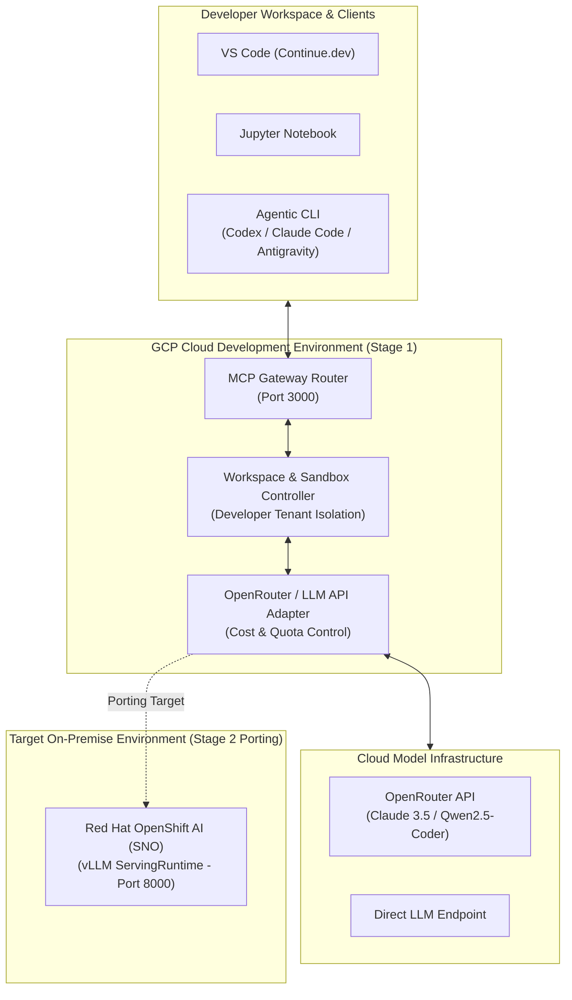

# 엔터프라이즈 코딩 에이전트 플랫폼 기본설계서 & 상세설계서

본 문서는 **구글 클라우드(GCP) 환경에서 개발을 시작하고, 향후 온프레미스(Red Hat OpenShift AI) 환경으로 이식(Porting)되는 엔터프라이즈 코딩 에이전트 플랫폼**의 아키텍처 기본설계서 및 상세설계서입니다.

---

## 1. 설계 개념 및 목적 (Design Concept & Objectives)

### 1.1 플랫폼 핵심 개발 목적
- **행사 시연 (10월 Red Hat Summit)**: 단 1대의 서버(Single Node OpenShift SNO) 위에서 보안 유출 없는 100% 온프레미스 코딩 에이전트의 라이브 시연.
- **사내 AI 기술력 홍보**: 퍼블릭 AI 대비 연간 60% 이상 비용 절감 및 100ms FIM(Fill-in-the-Middle) 타자 속도를 대시보드로 시각 증명.
- **오픈소스 생태계 기여**: 표준 MCP (Model Context Protocol) 게이트웨이 및 vLLM 어댑터를 커뮤니티에 공개하여 기술 파급력 확보.

### 1.2 대표 상용 솔루션 (Cursor, Claude Code) 대비 차별화 경쟁력
- **100% Air-Gapped On-Premise Native**: Cursor나 Claude Code 등 글로벌 TOP 솔루션이 제공하지 못하는 **단 1바이트의 유출도 없는 완전 폐쇄망 온프레미스 완결성**.
- **MCP 기반 IDE + CLI 통합 오케스트레이션**: VS Code(Continue.dev)와 Agentic CLI(Antigravity/Claude Code)를 단일 백엔드 MCP 라우터로 통합 제공.
- **GCP Cloud ➔ On-Premise 1-Click Portability**: 개발 시 GCP + OpenRouter API로 인프라 비용을 대폭 절감하고, 배포 시 1-Click으로 사내 OpenShift AI vLLM에 포팅되는 어댑터 아키텍처.

---

## 2. 아키텍처 기본 설계 (Basic System Architecture)

---

## 3. 세부 구성 요소 및 상세 설계 (Detailed Component Design)

### 3.1 개발자별 독립 워크스페이스 (Developer Workspace Isolation)
- **개념**: 개발자마다 격리된 샌드박스(Docker 컨테이너 / K8s 포드) 환경을 부여하여 코드 작성 및 빌드/테스트 격리.
- **테넌시 구현**: GCP GKE 또는 Docker Compose 상에 개발자 ID별 워크스페이스 볼륨(`volume-dev-user1`, `volume-dev-user2`) 분리 할당.

### 3.2 MCP (Model Context Protocol) 커넥터 & CLI 연동
- **MCP 라우터**: `VS Code`, `Jupyter`, 및 `Codex / Claude Code / Antigravity CLI`가 표준 JSON-RPC 프로토콜로 백엔드 에이전트 엔진과 통신.
- **LLM 호출 어댑터 (OpenRouter / Direct API)**:
  - 개발 시: **OpenRouter API** 또는 Direct API 호출을 수행하여 GCP 인프라 비용 소모를 대폭 절감.
  - 이식 시: OpenRouter API 어댑터를 **사내 OpenShift AI vLLM API** 호환 어댑터로 스위칭(1줄 설정 변경).

### 3.3 Cloud to On-Prem 하드웨어 포팅 전략 (Portability)
- **추상화 레이어**: OpenAI 호환 API 인터페이스 규격(`v1/chat/completions`, `v1/completions`)을 공통 인터페이스로 사용.
- **포팅 절차**:
  1. GCP 클라우드 상에서 OpenRouter API로 MCP 라우터 및 개발자 워크스페이스 기능 검증.
  2. 10월 Red Hat OpenShift AI(SNO) 온프레미스 서버 환경 배포.
  3. API Endpoint URL만 `https://openrouter.ai/api`에서 `http://qwen-coder.rhoai.svc:8000`으로 전환하여 100% 포팅 완료.

---

## 4. 개발-배포-테스트 가드레일 및 워크플로우 (Development Workflow)

### 4.1 Git 브랜치 전략 (Branching Strategy)
- `main`: 온프레미스/클라우드 프로덕션 배포용 안정 브랜치 (Protected)
- `staging`: GCP 클라우드 통합 테스트 및 QA 브랜치
- `feature/*`: 개발자별 워크스페이스 기능 구현 브랜치 (예: `feature/mcp-gateway`, `feature/sandbox-runner`)

### 4.2 작업 트라이어드 (Plan - Code - Doc) 가드레일
모든 신규 개발 작업 시 다음 3개 아티팩트가 1:1:1로 반사 생성되어야 머지(Merge)가 가능함:
1. **[작업계획서]**: `agentsmith/coding-agent/docs/plans/feature_name_plan.md`
2. **[개발된 코드]**: `agentsmith/coding-agent/src/...`
3. **[상세명세서]**: `agentsmith/coding-agent/docs/specs/feature_name_spec.md`

### 4.3 시크릿 보안 및 SAST 가드레일
- OpenRouter API Key 및 사내 토큰 유출 방지를 위한 **Pre-commit hook** 도입.
- 시크릿 감지 시 Git Commit 자동 차단 및 환경 변수 자동 스크러빙.

---

## 5. 단계별 구현 로드맵 (Phased Roadmap)

| 단계 | 추진 과제 | 핵심 목표 |
| :--- | :--- | :--- |
| **Phase 1 (GCP Cloud)** | OpenRouter 연동 & MCP 라우터 구축 | CLI(Antigravity/Claude Code) & IDE 연동 검증 |
| **Phase 2 (MVP UI/UX)** | 개발자 워크스페이스 UI/UX 구축 | 웹 대시보드 및 샌드박스 에러 셀프코렉션 시연 |
| **Phase 3 (Sample Preparation)** | 시연용 샘플 앱 준비 | 파이썬/자바 실시간 FIM 및 비동기 리팩토링 샘플 |
| **Phase 4 (On-Prem Porting)** | RHOAI SNO 이식 및 행사 전시 | 10월 Red Hat 행사 부스 라이브 시연 |
