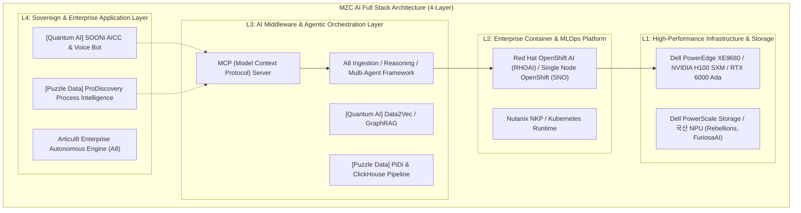

# [AI Full Stack] 퍼즐데이터 및 퀀텀AI 접목 유즈케이스 및 기술 분석 보고서

**문서 번호**: 2026-08-26_DOC_AI_FULLSTACK_PARTNERSHIP_ANALYSIS  
**작성 일자**: 2026-08-26 (개정: 2026-08-26)  
**작성 주체**: MegazoneCloud AI Full Stack TF / ISSU 팀  
**대상 기술/솔루션**: 퍼즐데이터 (Puzzle Data / ProDiscovery), 퀀텀AI (Quantum AI / SOONi), Articul8 (A8)

---

## 1. 개요 및 전략적 배경 (Executive Summary)

메가존클라우드(MZC)의 **AI Full Stack** 전략은 하드웨어 인프라(L1: Dell PowerEdge, NVIDIA GPU, 고성능 스토리지)와 컨테이너/MLOps 플랫폼(L2: Red Hat OpenShift AI)을 기반으로, 엔터프라이즈 레벨의 L4 소버린 플랫폼(**Articul8**) 및 도메인 특화 AI/데이터 솔루션을 유기적으로 결합하여 완성됩니다.

본 보고서는 **퍼즐데이터(Puzzle Data)**의 프로세스 인텔리전스 및 **퀀텀AI(Quantum AI)**의 멀티모달 대화형 AI 역량을 MZC 핵심 플랫폼인 **Articul8 (A8)**과 전략적으로 결합하거나, 퍼즐데이터의 유즈케이스를 Articul8의 자율 에이전트/인제스천 엔진으로 대체·고도화하여 차별화된 **AI Full Stack 신규 Use Case**를 도출하고, 부록으로 각 솔루션의 **기술적 장단점(Technical Pros & Cons)**을 심층 정리합니다.

---

## 2. 퍼즐데이터 × Articul8 (A8) 연계 및 대체 전략 분석

### 2.1 퍼즐데이터 핵심 역량과 한계 극복 (A8 연계 필요성)
- **퍼즐데이터 핵심 역량**: ClickHouse 기반 고성능 이벤트 로그 집계, 프로세스 흐름 시각화(Discovery), 병목 구간 모니터링 및 통계 시뮬레이션.
- **기존 프로세스 마이닝의 핵심 난제**:
  1. **초기 수작업 공수 과다**: SAP/ERP 커스텀 테이블 매핑 및 데이터 정제에 3~4개월 소요.
  2. **실행(Action) 에이전트 부재**: 프로세스 지연과 병목을 '탐지'하는 모니터링 수준에 머무르고, 시스템 파라미터를 변경하거나 비즈니스 액션을 직접 수행하는 자율 Worker 기능 결여.
- **Articul8 (A8) 결합 및 대체 시너지**:
  - **A8 Ingestion Engine 연계**: ERP/MES/ITSM 내 수십만 건의 비정형·정형 트랜잭션을 A8의 자동 인제스천 파이프라인으로 흡수하여 모델링 기간을 획기적으로 단축.
  - **A8 Autonomous Multi-Agent 실행**: 퍼즐데이터가 탐지한 이상/병목 이벤트를 트리거로 삼아, A8 다중 에이전트가 실시간 결재 승인, 구매 발주 조정, 대체 공정 스케줄링 등의 실제 업무를 자율 완결.

---

### 2.2 Articul8 기반 신규 & 고도화 Use Cases

#### [Use Case 1-1] A8 Autonomous Supply Chain & ERP Process Optimization (제조 SCM 자율 최적화)
- **적용 산업/도메인**: 반도체 장비, 정밀 부품 가공, 조선/중공업 (원익QnC, 디케이락, 한화오션 등)
- **접목 및 대체 구조**:
  - ProDiscovery의 이벤트 로그 분석 데이터 + A8의 Enterprise Ingestion/Reasoning 엔진을 결합하거나, ERP 전주기 프로세스 로그를 A8 에이전트 파이프라인으로 직접 수집·분석.
- **동작 시나리오**:
  1. **[감지 & 진단]**: 수주 → 발주 → 입고 → 생산 → QC 전 단계에서 특정 생산 주차의 원부자재 지연 위험 및 라인 병목을 실시간 탐지.
  2. **[A8 자율 추론 & 대안 도출]**: A8 Reasoning Engine이 부품 BOM 구조 및 협력사 재고 데이터를 즉시 크로스체크하여 "대체 가능 부품" 및 "대체 생산 라인 스케줄"을 다각도로 시뮬레이션.
  3. **[자율 액션 실행]**: A8 Multi-Agent가 ERP에 즉시 구매 발주 수정안을 등록하고, 생산 관리자에게 슬랙/메일/AICC 보이스 알림으로 원클릭 승인 요청 전달.
- **고객 가치**: 라인 셧다운 손실 제로화, SCM 프로세스 분석 및 조치 리드타임 3일 ➔ 실시간(5분 이내) 단축.

#### [Use Case 1-2] A8 Process-Aware Financial Compliance & Forensic AML (금융 이상거래·AML 자율 감사)
- **적용 산업/도메인**: 1금융권 은행, 증권, 상호금융, 보험 (BNK 금융지주, 새마을금고, DB증권 등)
- **접목 및 대체 구조**:
  - 코어뱅킹 계좌 간 다단계 자금 이동 로그와 결제 트랜잭션을 A8 Graph Reasoning & On-Premise Air-Gapped LLM 엔진으로 처리.
- **동작 시나리오**:
  1. **[복합 패턴 탐지]**: 단순 룰 기반 FDS를 우회하는 다단계 쪼개기 송금, 비정상적 승인 우회 경로를 실시간 시퀀스 그래프로 탐지.
  2. **[A8 감사 리포트 자동화]**: A8 LLM이 거래 맥락과 계좌 소유주 관계를 종합 분석하여 금융감독원 제출용 의심거래보고서(STR) 초안 및 감사 브리프를 100% 자동 생성.
  3. **[선제적 계좌 동결 추천]**: 위험 스코어가 임계치를 초과할 경우 이상 금융거래 차단 액션을 코어 시스템에 즉시 제안.
- **고객 가치**: 금융감독원 규제 준수 완결, 금융사기 피해 선제적 차단, 감사 인력의 수작업 소명서 작성 공수 85% 절감.

#### [Use Case 1-3] A8 Self-Healing Enterprise ITOM & Incident Remediation (엔터프라이즈 IT 자율 치유)
- **적용 산업/도메인**: 대기업 그룹사 IT 운영, 금융 차세대 데이터센터, 클라우드 MSP 관제
- **접목 및 대체 구조**:
  - ServiceNow, Jira, APM(IBQA 등) 장애 로그의 프로세스 흐름을 A8 Agentic Orchestration과 연결.
- **동작 시나리오**:
  1. **[선행 징후 포착]**: 시스템 장애 전조 증상(승인 대기열 지연, 특정 트랜잭션 큐 병목)을 감지.
  2. **[A8 근본 원인(RCA) 분석]**: 최근 배포된 Git 커밋, 인프라 설정 변경 이력과 매핑하여 장애 원인을 수초 내 규명.
  3. **[자율 복구(Self-Healing)]**: CI/CD 파이프라인 롤백 명령 송출, 트래픽 우회 라우팅 등 사전 승인된 복구 스크립트를 A8 에이전트가 자율 실행.
- **고객 가치**: MTTR(평균 장애 복구 시간) 70% 단축, 대규모 IT 운영 인건비 절감.

---

## 3. 퀀텀AI (Quantum AI) AI Full Stack 접목 Use Cases

### 3.1 솔루션 개요 및 핵심 기술 역량
- **핵심 솔루션**: **SOONi (통합 AICC 플랫폼)**, **Data2Vec 멀티모달 엔진**, **IDOP / IVOP / IIOP**
- **주요 특징**:
  - **All-in-One Infra-Free AICC**: CTI, IVR, 소프트웨어 PBX, STT(98%+), TTS, 녹취, KMS, RAG 일체형 내장 (착신 전환만으로 1~3개월 내 초고속 도입, TCO 50% 절감).
  - **초저지연 음성 처리 (1초 미만)** 및 자체 초경량 언어모델(sLLM, SSM/Mamba).
  - **1:N 하이브리드 상담**: 상담사 1인이 AI Agent Assist의 지원을 받아 동시 5명 응대 가능.
  - **완전 에어갭 온프레미스 지원**: 금융/공공/국방 망분리 완벽 대응.

---

### 3.2 핵심 Use Cases

#### [Use Case 2-1] 금융권 에어갭(Air-gapped) 풀스택 AICC & 여수신 심사/청구 자동화
- **타깃 고객**: 1금융권 은행, 보험사, 증권사 (BNK 금융지주, 우리은행, 대형 손해보험사)
- **접목 방식**: MZC Dell/NVIDIA 에어갭 인프라 + OpenShift AI 위에 SOONi 및 IDOP/IVOP 탑재.
- **동작 시나리오**:
  1. 고객 인입 시 목소리 생체인증(Voice Print, 5초 내 완료) 후 단순 업무 60%+ 무인 완결.
  2. 전문 상담 시 IVOP 실시간 STT와 IDOP 지능형 지식창고(GraphRAG)가 상담사 화면에 최적 답변 실시간 추천.
  3. 비정형 보험금 청구서 및 대출 심사 서류를 IDOP가 자동 추출/요약하여 코어뱅킹으로 전송.
- **고객 가치**: AICC 구축 기간 6개월 ➔ 1~3개월 단축, 운영비 50% 절감, 상담사 감정노동 대폭 완화.

#### [Use Case 2-2] 국방/방산/특수제조: 온프레미스 음성/VLM 기반 드론 및 로봇 PLC 자율 제어
- **타깃 고객**: 방위산업, 무인 항공, 특수 중공업 (현대로템 온프레미스 프로젝트)
- **접목 방식**: 이동형 작전 서버(RTX 6000 Ada / H100)에 퀀텀AI의 초저지연 음성 인식(IVOP), Llama/sLLM, VLM 및 제어 코드 생성 모듈 탑재.
- **동작 시나리오**:
  1. 지휘관의 자연어 음성 명령을 1초 미만 지연시간으로 텍스트화.
  2. 군사 작전 시나리오 벡터와 매핑하여 드론/로봇 하드웨어의 PLC 제어 코드(JSON)를 실시간 출력.
  3. 열화상/광학 영상(VLM)을 분석하여 피아 식별 및 장애물 회피를 온프레미스 엣지에서 자체 완결.
- **고객 가치**: 통신 두절/재밍 환경에서도 폐쇄망 독립 가동, 직관적 음성 기반 무인체계 통제.

#### [Use Case 2-3] 스마트 헬스케어: 병의원 행정 자동화 및 AI 환자 모니터링 해피콜
- **타깃 고객**: 대학병원, 전문 종합병원, 대형 검진센터
- **동작 시나리오**: 진료 예약/검사 일정 변경을 24/7 보이스봇이 자동 처리하고, 퇴원 환자 대상 정기 해피콜을 자율 수행하여 복약 여부 및 통증 수치를 EMR에 자동 기록.

---

### 3.3 MZC 파트너십 및 비즈니스 모델 연계
1. **Articul8 + 퀀텀AI 번들링 오퍼링**: MZC가 총판권을 보유한 Articul8(엔터프라이즈 인프라-오케스트레이션 엔진) 위에 퀀텀AI의 금융/조선 sLLM, RAG 콘텐츠, UI를 통합 번들링하여 **BNK 금융지주, DB증권, 한화오션, HD현대**에 원스톱 공급.
2. **에어갭 어플라이언스 SI 턴키 구축**: MZC 하이브리드 클라우드 인프라와 결합하여 온프레미스 AICC 및 도메인 LLM 구축 사업 공동 수행.

---

## 4. [부록] 솔루션별 심층 기술적 장단점 (Technical Pros & Cons Matrix)

### [부록 1] 퍼즐데이터 (ProDiscovery) vs Articul8 (A8) 비교 및 장단점

| 구분 | 퍼즐데이터 (ProDiscovery) | Articul8 (A8) | MZC 시너지 및 포지셔닝 |
| :--- | :--- | :--- | :--- |
| **핵심 강점 (Pros)** | • ClickHouse 기반 대용량 로그 초고속 집계 • 국내 주요 ERP(SAP, 영림원 등) 스키마 노하우 • 직관적인 프로세스 시각화 및 PiDi 도우미 | • 완전 자동화된 엔터프라이즈 데이터 인제스천 • 다중 자율 에이전트(Multi-Agent) 실행 완결력 • 엔터프라이즈 보안/라이선싱/거버넌스 완비 | • **ProDiscovery**: 프로세스 관제 및 병목 진단용 도구 • **Articul8**: 진단 결과를 바탕으로 자율 조치하는 실행 엔진으로 통합 |
| **한계점 (Cons)** | • 시스템 자동 조작(Worker) 에이전트 부재 • SAP 커스텀 데이터 매핑에 3~4개월 인력 투입 필수 • OCPM(객체 중심 마이닝) 개발 초기 단계 | • 순수 프로세스 마이닝 전용 시각화 UI는 별도 구성 필요 | • ProDiscovery의 수작업 데이터 매핑 한계를 A8의 자동 인제스천 파이프라인으로 극복 |

---

### [부록 2] 퀀텀AI (SOONi & Data2Vec) 기술적 장단점

| 구분 | 주요 강점 (Pros / Strengths) | 한계 및 고려사항 (Cons / Limitations) |
| :--- | :--- | :--- |
| **시스템 구조** | • **Infra-Free All-in-One**: CTI/PBX/IVR/STT/KMS/RAG 내장으로 고가 IPCC 장비 없이 **착신 전환만으로 1~3개월 내 도입** (비용 50%↓) | • **대형 레거시 교체 저항**: 이미 대규모 하드웨어 PBX(Avaya, Cisco 등)를 갖춘 대형 콜센터는 소프트웨어 PBX 전환 시 신중한 설득 필요 |
| **원천 AI 기술력** | • **초저지연 음성인식**: STT 98%+, 응답 지연 1초 미만 • **Data2Vec 통합 엔진**: 문서(IDOP), 음성(IVOP), 태깅(IIOP) 단일 처리 • **GraphRAG 결합**: 금융 약관/의료 지침 기반 환각 제로화 | • **자체 sLLM 범용성 한계**: 오픈 도메인의 복합 추론에서는 초대형 LLM 대비 파인튜닝 데이터 품질 의존도가 큼 |
| **에어갭 배포** | • **완전 폐쇄망 지원**: 외부 통신 없이 국방/금융 보안 요건 충족 • **경량화 인프라 최적화**: H100뿐만 아니라 RTX 6000 등 단일 GPU 구동 가능 | • **엔터프라이즈 패키징 도구**: Articul8 등 글로벌 플랫폼 대비 자동화된 라이선스/거버넌스 통합 관리 툴 추가 보완 필요 |
| **운영 효율성** | • **1:N 하이브리드 상담**: 상담사 1인이 AI 지원으로 동시 5명 응대 가능 | • **레거시 연동 SI 공수**: 고객사 CRM/EMR 연동을 위한 백엔드 인터페이스 개발 리소스 필요 |

---

### [부록 3] 4-Layer 아키텍처 상호 보완 매트릭스

| 레이어 | 퍼즐데이터 (ProDiscovery) | 퀀텀AI (SOONi / Data2Vec) | Articul8 (A8) | MZC 풀스택 인프라 & 플랫폼 |
| :--- | :--- | :--- | :--- | :--- |
| **L4: Enterprise Apps** | [Puzzle Data] ProDiscovery 프로세스 대시보드 | [Quantum AI] SOONi 올인원 AICC / Agent GUI | Articul8 엔터프라이즈 도메인 AI 앱 | 통합 엔터프라이즈 포털 제공 |
| **L3: AI Middleware** | [Puzzle Data] PiDi 쿼리 생성 & ClickHouse | [Quantum AI] Data2Vec / GraphRAG 멀티모달 | A8 자율 Multi-Agent & Ingestion Engine | MCP 표준 브로커 및 미들웨어 연동 |
| **L2: Container/MLOps** | Linux Service / Container | On-Premise Docker / K8s | OpenShift AI / K8s Native | Red Hat OpenShift AI (RHOAI) |
| **L1: Infrastructure** | 온프레미스 서버 / AWS | H100 / RTX 6000 Ada | H100 / H200 / Xeon 클러스터 | Dell PowerEdge, PowerScale, 국산 NPU |

---

## 5. 결론 및 향후 액션 플랜

1. **Articul8 + 퀀텀AI 금융·제조 패키지 우선 전개**:
   - MZC 클라우드 환경에서 Articul8 + 퀀텀AI PoC 환경을 선제 구성하고, **BNK 금융지주, DB증권, 한화오션** 대상 제안 추진.
2. **ProDiscovery + A8 결합 자율 SCM 최적화 레퍼런스 검증**:
   - 퍼즐데이터의 프로세스 탐색 모델과 A8의 자율 실행 에이전트를 결합하여 **원익그룹 및 디케이락** 대상 고도화 오퍼링 추진.
3. **MZC 4-Layer 표준 패키징 고도화**:
   - 하드웨어(Dell/NVIDIA) + 플랫폼(OpenShift AI) + 오케스트레이션(Articul8) + 도메인 특화 AI(Quantum AI, Puzzle Data)로 구성된 엔터프라이즈 에어갭 어플라이언스 상품화 완료.
