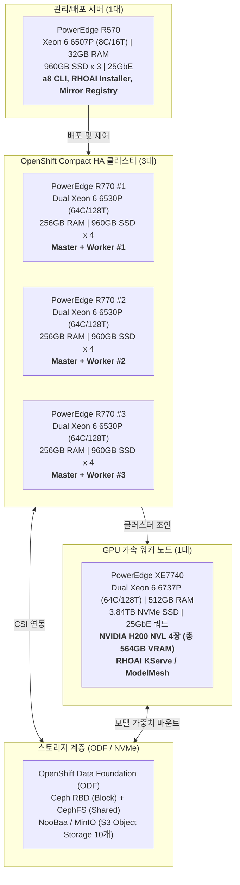
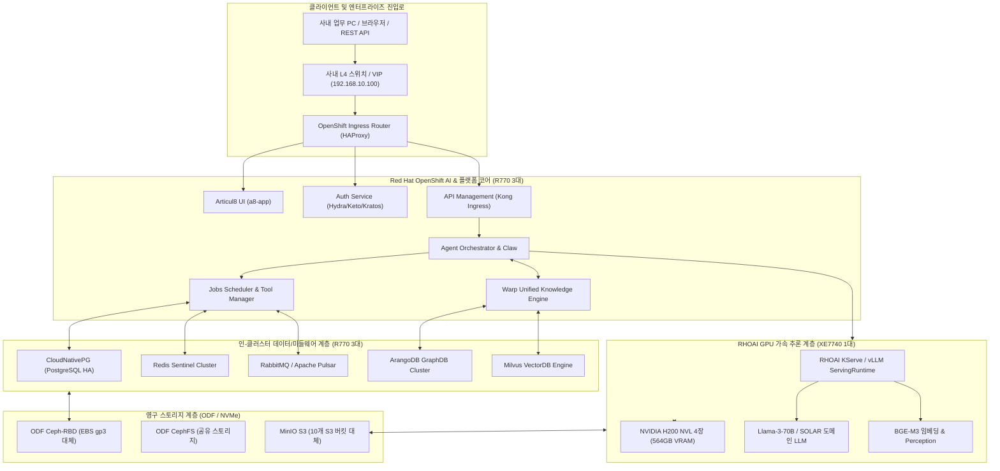

# [기술 보고서] Articul8 산출물 분석 및 On-Premise HW 기반 RHOAI 설치·구성 전략 보고서

- **작성일자**: 2026-09-11
- **작성주체**: AI Full Stack 아키텍처 TF (Antigravity & ISSU)
- **문서버전**: v1.0.0
- **대상 경로**: `C:\Users\MZC01-SUNKIM317\OneDrive\2026\ISSU\Articul8 (산출물)`
- **보고서 형식**: 전략 기술보고서 (Markdown) & 인터랙티브 대시보드 (HTML)

---

## Executive Summary (경영 요약)

본 보고서는 수집된 **Articul8 관련 산출물 55건(기술문서, 고객사 제안서, 운영 플레이북, 시스템 레퍼런스 북, 하드웨어 견적서 등)**을 전수 조사·분석하여, 현재 AWS EKS 환경에 구성된 Articul8 26.06 플랫폼을 **On-Premise HW(Dell PowerEdge R570, R770, XE7740 H200 등) 기반의 Red Hat OpenShift AI(RHOAI)** 환경으로 이전·설치하기 위한 기술적 요구사항, 아키텍처 구성 추정, 사전 파악 자료, YAML 옵션 대체 방안을 체계적으로 도출한 결과입니다.

### 핵심 진단 및 결론
1. **Articul8의 구조적 특성**: Articul8은 38개의 Helm Chart, 98개의 컨테이너 이미지, 22개 노드(316 Pods), 47개 PVC, 10개 S3 버킷, AWS RDS/ElastiCache 등으로 분산 구동되는 대규모 엔터프라이즈 AI 플랫폼(AgentMesh, ModelMesh, Warp GraphDB/VectorDB)입니다.
2. **On-Premise HW 인프라 적합성**: 제공된 하드웨어 견적(OpenShift Compact 노드 3대 [각 64C/256GB] + GPU Worker 1대 [H200 NVL 4장, 512GB] + Bastion 1대)은 AWS의 분산 인프라를 **Compact HA(고가용성) 클러스터로 집약(Consolidation)**하여 운영하기에 매우 적합하며, 특히 **H200 NVL(총 564GB VRAM)**은 기존 AWS p4de(A100 80GB x 8) 대비 동등 이상의 대형 LLM 추론 성능을 제공합니다.
3. **핵심 전환 과제**: AWS의 완전관리형 서비스(EKS, ALB, EBS gp3, S3, RDS, ElastiCache, IAM/IRSA)와 AWS 종속적인 `a8.yaml` 설정을 **RHOAI/OpenShift 생태계(OpenShift Route, ODF/Ceph, MinIO, CloudNativePG, Redis Operator, Vault, NVIDIA GPU Operator)**로 1:1 치환하고, 폐쇄망(Air-gapped) 환경에 맞춘 오프라인 이미지/모델 패키징을 수립해야 합니다.

---

## 1. 수집 자료 전수 조사 및 파일별 한 줄 요약 (총 55건)

수집된 산출물은 폴더 및 성격에 따라 5대 영역으로 분류되며, 각 파일의 핵심 내용은 다음과 같습니다.

### 1.1 하드웨어 견적 및 루트 파일 (3건)
| 파일명 | 용량 | 핵심 내용 및 한 줄 요약 |
| :--- | :---: | :--- |
| `MZ_SY_260828_008-AI Full Stack 서버 견적 건.xlsx` (루트) | 26 KB | 온프레미스 AI Full Stack용 Dell PowerEdge R570(Bastion), R770(OpenShift Compact 3노드), XE7740(H200 4GPU 1노드)의 세부 견적 및 사양서 (약 8.18억 원). |
| `HW 견적\MZ_SY_260828_008-AI Full Stack 서버 견적 건.xlsx` | 26 KB | 상기 루트 견적서와 동일본으로, On-Prem RHOAI 및 Articul8 인프라 구축의 기준이 되는 핵심 HW 스펙 시트. |
| `HW 견적\견적서_260731_1_메가존클라우드(쿠팡)_PowerEdge XE9780.xlsx` | 22 KB | 대규모 AI 파운데이션 모델 학습/추론을 위한 Dell PowerEdge XE9780 (HGX B300 8 GPU x 2대 = 16 GPU) 고사양 서버 견적서 (약 45.7억 원). |

### 1.2 05. 메가존클라우드 기술자료 (23건) - 핵심 기술/운영 자료
| 파일명 | 용량 | 핵심 내용 및 한 줄 요약 |
| :--- | :---: | :--- |
| `Articul8_Installation_Operations_Playbook_v2.0.html` | 24 KB | Articul8 26.06 표준 설치 순서, 사전점검, 수용검사, ECR 403 장애 대응, 일상 운영 절차를 집대성한 웹 기반 운영 매뉴얼. |
| `Articul8_System_Reference_Book_v2.0.html` | 26 KB | 38개 Helm Chart, 98개 이미지, 22개 EKS 노드, 47개 PVC 등 AWS 실측 아키텍처 인벤토리와 A8 CLI 전체 명령어를 정리한 기술 사전. |
| `Articul8_megazone_기술명세_가이드_v1.1_2026-07-26.docx` | 74 KB | 실제 배포된 `a8.yaml` 설정값, AWS 리소스 세부 구성, 배포 순서 및 관리 서버(EC2) 상태를 기술한 최신 기술명세서. |
| `Articul8_megazone_기술명세_가이드_2026-07-26.docx` | 64 KB | megazone 배포 기준 AWS EKS 설치 패키지 및 아키텍처 초기 기술명세서. |
| `Articul8_System_Operations_Technical_Guide_v2.0_2026-07-26.docx` | 62 KB | Playbook과 Reference Book을 Word 문서 형태로 통합하여 운영 지침과 시스템 명세를 함께 수록한 운영 가이드. |
| `A8 회의 - 2026_08_31 11_01 KST - Notes by Gemini.pdf` | 94 KB | 김성호 님, 신준용 님 등이 참석하여 A8 현황 진단, 에어갭(폐쇄망) 환경 라마 기반 모델 적용, 풀스택 AI 아키텍처 수립을 논의한 회의록. |
| `A8-Arch-CustomerFacing-August2026.pdf` | 428 KB | 고객용 Articul8 아키텍처 다이어그램으로 UI, API Gateway, Agent Orchestrator, Model Serving, Warp Data Layer 구조 요약. |
| `Articul8_ModelMesh_Pilot_수행계획서_SOW_WBS_예시본_v2.docx` | 95 KB | Articul8 ModelMesh 파일럿 프로젝트의 작업 범위(SOW), 추진 일정, WBS 및 산출물 정의 예시 문서. |
| `Articul8_ModelMesh_Pilot_수행계획서_SOW_WBS_예시본_v2.pptx` | 4.85 MB | 상기 ModelMesh 파일럿 SOW/WBS 문서를 발표용 슬라이드 형태로 구성한 제안 자료. |
| `Articul8_vs_SemiKong_상세비교_원익IPS_폐쇄망분석.pptx` | 227 KB | 원익IPS 대상 Articul8과 SemiKong 솔루션의 아키텍처, 성능, 폐쇄망 구축 역량을 비교 분석한 보고서. |
| `Articul8_고객_솔루션_라이프사이클_v1.docx` | 42 KB | 고객 환경에서 Articul8 도입 준비부터 파일럿, 프로덕션 배포, 운영 유지보수까지의 단계별 생애주기 정의서. |
| `Articul8_실무자_기술_내재화_가이드_2026-07-26.docx` | 26 KB | 메가존클라우드 엔지니어가 Articul8 설치, CLI 조작, GitOps 및 트러블슈팅 역량을 내재화하기 위한 실무 가이드. |
| `Articul8_실무자_기술_내재화_가이드_2026-07-26 (1).docx` | 26 KB | 상기 실무자 기술 내재화 가이드의 동일본/수정 검토본. |
| `Articul8-Customer-Solution-Lifecycle.pdf` | 2.34 MB | Articul8의 고객 솔루션 라이프사이클(준비-구축-운영)을 도식화하여 설명하는 영문 공식 가이드. |
| `Articul8_AI_기술자료집_v1.0(한화시스템).pptx` | 6.77 MB | 한화시스템을 대상으로 Articul8의 생성형 AI 플랫폼 아키텍처와 엔터프라이즈 적용 방안을 제시한 기술 자료집. |
| `Articul8_AI_기술자료집_v1.1(한화시스템).pptx` | 8.12 MB | 한화시스템용 AI 기술자료집의 개정 증보판으로 유스케이스 및 기술 스펙 고도화 반영본. |
| `[KR] A8 Platform - Introduction.pdf` | 2.19 MB | Articul8 플랫폼의 핵심 가치, Full-Stack 생성형 AI 엔터프라이즈 기능 및 아키텍처 한글 소개서. |
| `A8 Platform - Intro & Proof Points.pptx` | 25.11 MB | Articul8 플랫폼의 기술 소개 및 글로벌 고객 구축 레퍼런스/성공 사례(Proof Points) 발표 자료. |
| `[MZ] A8 Platform Deck_V7.pptx` | 13.54 MB | 메가존클라우드에서 활용하는 Articul8 공식 플랫폼 소개 덱 V7 (풀스택 AI 아키텍처 및 강점). |
| `[MZ] DPaaS & MTaaS Pitch.pptx` | 30.09 MB | Articul8의 Data Platform as a Service 및 Model Training as a Service 비즈니스 피칭 덱. |
| `[Mirae Life] Articul8 Platform Overview For FSI.pptx` | 76.81 MB | 미래에셋생명 등 금융권(FSI) 대상 규제 준수, 보안, 금융 도메인 지식 그래프 및 생성형 AI 구축 방안 소개. |
| `한화오션_AI문서인텔리전스_4주파일럿제안서_v2.0.docx` | 256 KB | 한화오션 대상 도면/기술문서 분석을 위한 Articul8 4주 파일럿(PoC) 구축 제안서. |
| `UseCase10_FinancialServices_reformatted.pptx` | 31 KB | 금융권 특화 10대 AI 유스케이스(리스크 분석, 규제 컴플라이언스, 고객 응대 등) 요약 자료. |

### 1.3 04. Articul8 기술자료 (19건) - 원천 제조사 기술 및 플레이북
| 파일명 | 용량 | 핵심 내용 및 한 줄 요약 |
| :--- | :---: | :--- |
| `Workshop\Articul8 a8 CLI — Comprehensive Training.pdf` | 1.68 MB | a8 CLI 구조, 설치/설정 플래그, Kubernetes 디버깅, 백업/복구 실습을 다룬 심층 교육 워크숍 교재. |
| `A8_Platform_Fundamentals (4).pptx` | 9.85 MB | Articul8의 데이터 계층(Warp), 모델 서빙(ModelMesh), 에이전트 오케스트레이션 기초 원리 설명서. |
| `Articul8 FSI Platform Overview May 2026.pdf` | 5.73 MB | 금융 서비스 산업(FSI)을 위한 엔터프라이즈 AI 거버넌스 및 플랫폼 개요서. |
| `Articul8 GTM 2026 KR.pptx` | 10.18 MB | 한국 시장 대상 Articul8 2026년 Go-To-Market(시장 진출) 영업 및 마케팅 전략. |
| `Articul8 GTM 2026 KR_051226.pptx` | 11.16 MB | 5월 12일 업데이트된 한국 시장 맞춤형 GTM 추진 계획 발표 덱. |
| `Articul8 GTM 2026 KR_2026.pdf` | 18.58 MB | Articul8 2026 GTM 전략 보고서의 고해상도 배포용 PDF 문서. |
| `Articul8-Customer-Solution-Lifecycle (1).pdf` | 2.34 MB | 고객 솔루션 라이프사이클 프로세스 매뉴얼 (설계-배포-운영-확장 가이드). |
| `Articul8CustomerSolutionLifecycle (1).docx` | 867 KB | 고객 라이프사이클 세부 가이드라인의 편집 가능한 원본 워드 문서. |
| `[Megazone] Sales Enablement May 2026.pdf` | 6.39 MB | 메가존클라우드 영업 및 프리세일즈 인력을 위한 Articul8 제품 교육 및 고객 대응 핸드북. |
| `[MZ] A8 Platform Deck_V7 (1).pptx` | 3.52 MB | A8 플랫폼 소개 덱 V7의 경량화 배포본. |
| `[MZ] DPaaS & MTaaS Pitch (1).pptx` | 23.29 MB | 데이터 및 모델 서빙 플랫폼 서비스 피칭 자료 사본. |
| `Playbook\A8_Aerospace_Defense_Sales_Playbook (1).pptx` | 9.76 MB | 항공·우주·방위산업 고객 대상 영업 플레이북 (보안 및 폐쇄망 요구 대응). |
| `Playbook\A8_Automotive_Sales_Playbook (1).pptx` | 9.76 MB | 자동차·모빌리티 산업 대상 AI 적용 시나리오 및 세일즈 전략. |
| `Playbook\A8_Energy_Utilities_Sales_Playbook (1).pptx` | 9.76 MB | 에너지·유틸리티 산업의 인프라 모니터링 및 AI 자동화 플레이북. |
| `Playbook\A8_Financial_Services_Sales_Playbook (1).pptx` | 9.76 MB | 금융권 영업을 위한 리스크 관리 및 규제 준수 특화 세일즈 가이드. |
| `Playbook\A8_Manufacturing_Sales_Playbook (2).pptx` | 9.76 MB | 제조업 스마트 팩토리, 품질 관리, 생산성 향상을 위한 세일즈 플레이북. |
| `Playbook\A8_Retail_Sales_Playbook (1).pptx` | 546 KB | 리테일·유통 기업을 위한 고객 경험 최적화 및 수요 예측 AI 플레이북. |
| `Playbook\A8_SupplyChain_Sales_Playbook (1).pptx` | 9.76 MB | 공급망 관리(SCM), 물류 최적화, 재고 관리를 위한 세일즈 가이드. |
| `Playbook\A8_Telco_Sales_Playbook_.pptx` | 9.76 MB | 통신 산업 망 관리 및 고객 센터 AI 혁신을 위한 영업 플레이북. |

### 1.4 01. 고객사 Optty & 03. Project (10건) - 영업 기회 및 실제 제안서
| 파일명 | 용량 | 핵심 내용 및 한 줄 요약 |
| :--- | :---: | :--- |
| `01. 고객사 Optty\01.경동나비엔\경동나비엔_CopilotCredits_비용관리_기술방안.pptx` | 1.04 MB | 경동나비엔 대상 M365 Copilot 크레딧 사용량 및 비용 관리 기술 방안. |
| `01. 고객사 Optty\01.경동나비엔\경동나비엔_M365_Copilot_헤비유저_비용통제_Articul8_기술방안.pptx` | 72 KB | Copilot 과다 사용자 비용 통제를 위해 Articul8 온프레미스 연계를 제안한 기술 문서. |
| `01. 고객사 Optty\02.HD현대\HD현대 Articul8에 대한 6가지 DEMO 동영상 설명서.docx` | 3.06 MB | HD현대 경영진 시연용 6대 AI 데모 시나리오 및 기능 설명서. |
| `01. 고객사 Optty\02.HD현대\HD현대_Articul8_발표용(30분) (2).pdf` | 3.56 MB | HD현대 대상 30분 압축 기술 발표용 PDF 자료. |
| `01. 고객사 Optty\02.HD현대\HD현대_Articul8_발표용(30분) [자동 저장됨].pptx` | 8.01 MB | HD현대 발표용 슬라이드 원본 PPTX. |
| `01. 고객사 Optty\02.HD현대\메가존_AI_솔루션_소개서_(820) [자동 저장됨].pptx` | 8.43 MB | HD현대 대상 메가존 AI 풀스택 솔루션 종합 제안서. |
| `01. 고객사 Optty\03.원익홀딩스\메가존_AI_솔루션_소개서_(820).pptx` | 8.44 MB | 반도체/디스플레이 계열 원익홀딩스 대상 엔터프라이즈 AI 도입 제안서. |
| `01. 고객사 Optty\05.Hitech\메가존_AI_솔루션_설명회(Hitech)_최종본(0814).pptx` | 8.33 MB | 하이테크 제조 고객 대상 AI 솔루션 설명회 최종 발표 자료. |
| `01. 고객사 Optty\06.현대글로비스\현대글로비스_2027년사업계획 제안(AI) (1).pptx` | 7.11 MB | 현대글로비스 2027 사업계획 연계 물류 AI 지능화 제안서. |
| `03. Project\01. Proposal\메가존클라우드_NH 투자증권 AI 플랫폼 구축 _제안서_260810 (1).pdf` | 25.02 MB | NH투자증권 AI 통합 플랫폼 구축 사업의 공식 기술 제안서 (대규모 구축 사례). |

---

## 2. On-Premise HW에 RHOAI 설치 후 Articul8 구성 방안 (추정 및 근거)

### 2.1 하드웨어 인벤토리 및 역할 정의 (견적서 기준)
견적서(`MZ_SY_260828_008-AI Full Stack 서버 견적 건.xlsx`)에 명시된 5대의 서버 자원을 다음과 같이 역할별로 할당합니다.



1. **Bastion / Installer (PowerEdge R570 1대)**:
   - OS: Red Hat Enterprise Linux 9 (RHEL 9)
   - 역할: OpenShift 클러스터 설치 배포자, a8 CLI 26.06 실행 환경, 폐쇄망 미러 레지스트리(Mirror Registry / Quay), 로컬 Helm/GitOps 캐시.
2. **OpenShift Compact Control Plane + Worker 노드 (PowerEdge R770 3대)**:
   - 총 가용 스펙: **192코어 / 384스레드, 768GB RAM, SSD 960GB x 12 (약 11.5TB)**
   - 토폴로지: **OpenShift 3-Node Compact Cluster** (마스터 노드와 일반 워커 노드를 겸용하여 3대로 Quorum 형성 및 고가용성 보장).
   - 탑재 워크로드:
     - OpenShift 핵심 컴포넌트 (API Server, etcd, Ingress Router, OVN-Kubernetes CNI)
     - RHOAI Operator, KServe, ModelMesh Controller, Dashboard
     - Articul8 핵심 플랫폼 파드 (UI, Auth-Hydra/Keto/Kratos, API Gateway, Agent Manager, Agent Orchestrator, Claw, Jobs, Tools)
     - 인-클러스터 데이터 계층 (CloudNativePG PostgreSQL, Redis HA, RabbitMQ, ArangoDB GraphDB, Milvus VectorDB CPU 코디네이터)
     - 스토리지 계층: OpenShift Data Foundation (ODF) 또는 Local Storage Operator (LSO).
3. **GPU Worker 노드 (PowerEdge XE7740 1대)**:
   - 가용 스펙: **64코어 / 128스레드, 512GB RAM, 3.84TB 고속 NVMe SSD, NVIDIA H200 NVL 4장 (141GB HBM3e x 4 = 총 564GB VRAM)**
   - 역할: GPU 집약적 추론 워크로드 전담.
   - 탑재 워크로드:
     - NVIDIA GPU Operator & NFD(Node Feature Discovery)
     - RHOAI KServe / vLLM 런타임: Llama-3-70B (FP16 또는 FP8), 도메인 특화 SLM
     - Articul8 ModelMesh (Scorpio 프로파일) 및 임베딩 모델(BGE-M3 등), Perception Worker.

### 2.2 추정의 상세 근거
1. **AWS 실측 인프라 대비 자원 집약(Consolidation) 가능성**:
   - `Articul8_System_Reference_Book_v2.0.html`에 따르면, AWS 실측 환경은 22개 노드에 316개 파드가 실행되고 있었습니다. 그러나 AWS 환경의 노드 다수는 클라우드의 작은 인스턴스(m5/c5 계열)로 잘게 쪼개져 있었고, 파드당 실제 요청량(Request)은 CPU 0.1~0.5 Core, Memory 256MB~2GB 수준의 경량 마이크로서비스였습니다.
   - 온프레미스 R770 3대의 총 192코어/768GB RAM은 오버커밋(Overcommit)을 전혀 하지 않더라도 300여 개 파드를 호스팅하기에 충분한 용량입니다 (노드당 평균 100개 파드 수용, 쿠버네티스 노드당 기본 한도 250개 이내).
2. **GPU VRAM 및 연산량 대조**:
   - AWS 환경의 `a8.yaml`은 `p4de.24xlarge` (NVIDIA A100 80GB x 8 = 총 640GB VRAM)를 사용하여 MIG(`a100-mig`) 프로파일로 구성되어 있었습니다.
   - 온프레미스 견적의 **H200 NVL 4장**은 장당 141GB의 초대형 HBM3e 메모리를 탑재하여 **총 564GB VRAM**을 제공합니다. H200은 A100 대비 메모리 대역폭이 4.8TB/s로 2.4배 이상 빠르며, 최신 FP8 트랜스포머 엔진을 내장하고 있어, 4장만으로도 A100 8장의 처리량을 상회하는 대형 LLM 동시 추론 처리가 가능합니다.
3. **스토리지 실측치 대응**:
   - AWS 실측 47개 PVC 합계는 14,798 GiB (약 14.8TB)이나, 실제 사용률(Used)은 수 TB 수준입니다.
   - R770 3대의 SSD 풀(약 11.5TB)과 XE7740의 3.84TB NVMe를 묶어 ODF 블록 스토리지로 프로비저닝하거나, 사내 외장 스토리지(SAN/NAS)를 iSCSI/NFS로 마운트하면 완벽히 수용됩니다.

---

## 3. AWS 대비 RHOAI(On-Prem) 설치 시 사전 파악 및 준비 필요 자료

AWS는 완전관리형 PaaS(EKS, RDS, ElastiCache, S3, ALB, Route53, IAM)가 인프라 하부를 지탱하고 있었으나, 온프레미스 RHOAI는 이를 쿠버네티스 인-클러스터 또는 사내 레거시 인프라로 직접 구축해야 합니다. 따라서 다음 7개 영역의 기술 자료가 사전에 반드시 파악되어야 합니다.

```mermaid
mindmap
  root((RHOAI On-Prem<br>사전 파악 자료))
    Articul8 공식 규격
      a8 CLI 온프레미스 모드 지원 여부
      Helm Chart Standalone DB/S3 옵션
      릴리스 26.06 바이패스 절차
    폐쇄망 오프라인 패키지
      98개 컨테이너 이미지 Tarball & Checksum
      사전 학습 모델 가중치 파일 다운로드 경로
      A8 CLI 라이선스 오프라인 활성화 키
    스토리지 아키텍처
      10개 S3 버킷 대체 스펙 (ODF/MinIO)
      47개 PVC 성능 요건 (IOPS, Latency)
      ArangoDB Hotbackup 타깃 지원 규격
    데이터베이스 계층
      PostgreSQL 버전 및 필수 Extension (pgvector 등)
      Redis 세션/캐시 클러스터링 요구사항
    GPU 및 RHOAI 서빙
      NVIDIA H200 NVL CoreOS 드라이버 호환성
      RHOAI KServe vs A8 ModelMesh 통합 방식
    네트워킹 및 인그레스
      OpenShift Route TLS Termination 정책
      MetalLB L4 VIP 또는 사내 L4 스위치 연동
    인증 및 보안 거버넌스
      사내 IdP (Active Directory/LDAP/Keycloak) 연동
      사내 사설 CA (Internal Root CA) 인증서 배포
```

### 3.1 세부 파악 항목 목록

1. **Articul8 제조사의 On-Premise 배포 지원 공식 가이드**:
   - `a8 install` 명령에 `--skip-terraform`을 적용하고 온프레미스 OpenShift 클러스터를 타깃으로 배포할 수 있는 공식 매니페스트(`mustache-input` 템플릿)가 존재하는지 여부.
   - AWS 외에 `provider: onprem` 또는 `provider: openshift` 스키마 정의서.
2. **폐쇄망(Air-Gapped) 오프라인 패키지 및 라이선스 키**:
   - 기존의 치명적 장애였던 **"공급사 ECR(211125640135) 403 Forbidden"** 문제를 원천 차단하기 위한 98개 컨테이너 이미지 오프라인 번들(`tar.gz`) 및 SHA-256 체크섬.
   - 인터넷 연결 없이 활성화할 수 있는 Articul8 플랫폼 라이선스 키 파일 및 설치 워크스페이스의 오프라인 인증 절차.
3. **10개 S3 버킷에 대한 요구 성능 및 엔드포인트 호환성**:
   - Articul8이 사용하는 10대 S3 버킷(DataPilot, Flyte, Loki, ModelMesh, Orchestrator Tasks, Service, SLD-SVC, Terragrunt, VectorDB, Workflows)의 S3 API 호환성 요구조건.
   - MinIO 또는 ODF NooBaa(Multi-Cloud Object Gateway) 사용 시 Presigned URL 및 Multipart Upload 지원 여부.
4. **RDS PostgreSQL 및 ElastiCache Redis 접속 규격**:
   - RDS 대신 온프레미스 인-클러스터 PostgreSQL(예: CloudNativePG Operator)을 사용할 때 필요한 DB 사용자, 스키마 초기화 스크립트, 확장 모듈(Extension: pg_trgm, uuid-ossp, pgvector 등).
   - Redis의 비밀번호/TLS 적용 규격 및 Sentinel/Cluster 모드 지원 여부.
5. **NVIDIA H200 NVL 가속기 및 RHOAI 드라이버 적합성**:
   - Red Hat Enterprise Linux CoreOS(RHCOS) 상에서 NVIDIA GPU Operator 24.x+ 및 H200 NVL 드라이버(CUDA 12.4+) 정상 구동 여부.
   - Articul8 ModelMesh가 RHOAI의 기본 ServingRuntime(KServe / vLLM)을 활용하는지, 아니면 자체 컨테이너로 서빙을 직접 띄우는지 인터페이스 파악.
6. **네트워크 인그레스 및 도메인/인증서 체계**:
   - `megazone.articul8.ai`와 같은 공용 FQDN 대신 고객사 사내망 DNS(예: `a8.internal.company.com`) 등록 절차.
   - AWS Certificate Manager(ACM)를 대체할 사내 사설 Root CA 인증서(Secret) 등록 체계.
7. **ArangoDB Enterprise 백업 스토리지 타깃**:
   - A8 시스템의 지식 그래프(Knowledge Graph) 핵심인 ArangoDB 백업 시, AWS S3 외에 온프레미스 S3 엔드포인트(`--upload` 플래그 사용 시)가 정상 지원되는지 파악.

---

## 4. YAML 상의 AWS 전용 옵션 분석 및 RHOAI/On-Prem 대체 매핑

`Articul8_megazone_기술명세_가이드_v1.1` 6장에 기재된 `a8.yaml` 원본과 Kubernetes 매니페스트에 나타난 AWS 전용 키워드를 OpenShift/RHOAI 온프레미스 환경으로 치환하는 상세 전략입니다.

### 4.1 a8.yaml 원본 대비 RHOAI 온프레미스 변환 비교

```yaml
# ==========================================
# [기존] AWS EKS 기반 a8.yaml 원본
# ==========================================
apiVersion: v1
metadata:
  name: "Infra configs aws manifest"
deploymentConfig:
  cluster:
    name: megazone
  dns:
    ui_external_dns: megazone.articul8.ai
  provider:
    aws:
      account: "678342631305"
      cidr: 10.10.0.0/16
      eks:
        model_inference_large_group_instance_type: p4de.24xlarge
      loadBalancer:
        scheme: internet-facing
      region: us-east-1
  release:
    version: "26.06"
  platform:
    modelmesh:
      profile: scorpio
    models:
      gpuProfile: a100-mig
      enableNer: false
    monitoring:
      enabled: true
      managedGrafana:
        enabled: false
    ui:
      enabled: true
```

```yaml
# ==========================================
# [대체안] On-Premise RHOAI 기반 a8-onprem.yaml 변환안
# ==========================================
apiVersion: v1
metadata:
  name: "Infra configs onprem rhoai manifest"
deploymentConfig:
  cluster:
    name: aifullstack-onprem
  dns:
    ui_external_dns: a8.onprem.internal.net
  provider:
    onprem:                            # [치환] aws -> onprem (또는 openshift)
      datacenter: "datacenter-1"       # [치환] region: us-east-1 대체
      network:
        ingress_vip: "192.168.10.100"  # [치환] ALB 대체 (MetalLB 또는 사내 L4 VIP)
        cluster_cidr: "10.128.0.0/14"  # [치환] OVN-Kubernetes Pod 대역
        service_cidr: "172.30.0.0/16"  # [치환] OpenShift Service 대역
      rhoai:
        serving_engine: "kserve-vllm"  # [치환] RHOAI 표준 KServe 서빙 엔진
        gpu_target: "h200-nvl"         # [치환] p4de.24xlarge 대체 (H200 4GPU)
        accelerator_profile: "nvidia-h200"
      loadBalancer:
        type: "openshift-route"        # [치환] AWS ALB -> OpenShift HAProxy Route
        tls_termination: "edge"
  release:
    version: "26.06"
  platform:
    modelmesh:
      profile: scorpio
    models:
      gpuProfile: h200-nvl-full        # [치환] a100-mig -> h200-nvl-full (4GPU 직접 할당)
      enableNer: false
    monitoring:
      enabled: true
      managedGrafana:
        enabled: false                 # OpenShift User Workload Monitoring 활용
    ui:
      enabled: true
    storage:                           # [추가] AWS 매니지드 스토리지 대체 설정
      storageClass: "ocs-storagecluster-ceph-rbd" # AWS ebs-sc 대체
      sharedStorageClass: "ocs-storagecluster-cephfs"
      s3Endpoint: "http://minio.storage.svc:9000" # AWS S3 대체 (인클러스터 MinIO)
      databaseHost: "postgres-cluster.database.svc" # AWS RDS 대체
      redisHost: "redis-cluster.cache.svc"        # AWS ElastiCache 대체
```

### 4.2 인프라 및 쿠버네티스 리소스별 1:1 기술 대체 매핑 테이블

| AWS 전용 리소스 및 옵션 | AWS 환경 동작 | RHOAI / On-Prem 대체 기술 | 구체적 대체 구현 방식 및 설정 |
| :--- | :--- | :--- | :--- |
| **`provider.aws.account`** | AWS 계정 ID 기반 IAM 및 리소스 권한 제어 | **OpenShift ServiceAccount & RBAC** | 계정 번호 필드 제거, 네임스페이스별 ServiceAccount 생성 및 사내 테넌트 ID 부여. |
| **`provider.aws.region`** | AWS 가용 리전 (`us-east-1`) | **Node Topology Label** | `topology.kubernetes.io/zone: dc1-rack1` 라벨 기반 노드 친화도(Affinity) 제어. |
| **`eks.model_inference_large_group_instance_type: p4de.24xlarge`** | AWS P4de EC2 VM 인스턴스 자동 스케줄링 | **RHOAI AcceleratorProfile + NodeSelector** | `nodeSelector: node-role.kubernetes.io/gpu: ""` 및 `resources: { limits: { nvidia.com/gpu: 4 } }`로 H200 GPU 직접 바인딩. |
| **`loadBalancer.scheme: internet-facing`** & ALB Controller Annotations | AWS Internet-Facing ALB 및 TargetGroup 자동 생성 | **OpenShift Ingress Route / MetalLB** | `kind: Route` (Edge TLS termination) 생성 및 사내 L4 스위치/MetalLB를 통해 VIP(`192.168.10.100`) 할당. |
| **`StorageClass: ebs-sc`** (`ebs.csi.aws.com`, gp3) | AWS EBS 볼륨 동적 프로비저닝 (47개 PVC) | **OpenShift Data Foundation (ODF) / LSO** | `ocs-storagecluster-ceph-rbd` (블록) 및 `ocs-storagecluster-cephfs` (공유 볼륨)로 100% 매핑. |
| **`AWS S3 Buckets`** (10개 버킷) | 비정형 데이터, 모델 가중치, 워크플로 저장소 | **ODF NooBaa (MCG) 또는 MinIO Enterprise** | OpenShift 상에 MinIO 또는 NooBaa를 배포하고, S3 호환 ObjectBucketClaim(OBC) 생성 후 시크릿으로 엔드포인트 주입. |
| **`AWS RDS PostgreSQL`** | 플랫폼 관리형 RDBMS | **CloudNativePG Operator 또는 Crunchy PG** | 오픈소스 CloudNativePG CRD를 배포하여 Master-Standby 고가용성 3노드 PostgreSQL 구성 및 자동 백업(PVC/MinIO). |
| **`AWS ElastiCache Redis`** | 인메모리 캐시 및 세션 저장소 | **OT-Container-Kit Redis Operator** | 인-클러스터 Redis Sentinel 3노드 복제 클러스터 구성으로 무중단 장애조치 구현. |
| **`AWS IAM Roles for Service Accounts (IRSA)`** | Pod에 AWS 리소스 접근 임시 토큰 발급 | **HashiCorp Vault + External Secrets Operator** | 기존 External Secrets Operator를 유지하면서 SecretStore의 Provider를 AWS SecretsManager에서 **온프레미스 Vault**로 변경. |
| **`Karpenter (AWS Node Autoscaler)`** | 트래픽 증가 시 EC2 노드 프로비저닝 | **KEDA (Kubernetes Event-driven Autoscaling)** | 물리 서버 특성상 베어메탈 노드 증설은 불가하므로, **파드 수준 수평 확장(HPA/KEDA)** 및 GPU 메모리 공유(MPS/MIG)로 대체. |

---

## 5. RHOAI 기반 온프레미스 아키텍처 상세 설계

### 5.1 계층별 논리 아키텍처 (Layered Architecture)



### 5.2 단계별 온프레미스 구축 절차 가이드 (Playbook)

1. **1단계: 하드웨어 및 OS 부트스트래핑 (Dell Bastion & RHEL)**:
   - Bastion R570 서버에 RHEL 9 설치 및 네트워크 본딩(25GbE LACP), DNS 캐시(dnsmasq), 방화벽 설정.
   - Dell iDRAC10을 통해 R770 3대와 XE7740 1대의 BIOS 성능 프로파일 활성화, SR-IOV 및 PCIe bifurcation 점검.
2. **2단계: OpenShift 3-Node Compact 클러스터 설치**:
   - OpenShift 4.16+ IPI/UPI Assisted Installer를 활용하여 R770 3대를 Compact 클러스터(Master+Worker 겸용)로 배포.
   - XE7740을 별도 GPU 전용 Worker 노드로 클러스터에 조인(`node-role.kubernetes.io/worker: ""`, `node-role.kubernetes.io/gpu: ""`).
3. **3단계: 스토리지 및 인프라 Operator 설치**:
   - Local Storage Operator(LSO) 또는 OpenShift Data Foundation(ODF) 배포 -> `ocs-storagecluster-ceph-rbd` StorageClass 생성.
   - MinIO Operator 배포 -> S3 호환 10개 버킷(datapilot, modelmesh, workflows 등) 사전 생성.
   - CloudNativePG Operator 및 Redis Operator 배포 -> 플랫폼용 고가용성 DB 인스턴스 생성.
4. **4단계: RHOAI 및 NVIDIA GPU Operator 설치**:
   - Red Hat OpenShift AI Operator 및 Node Feature Discovery(NFD), NVIDIA GPU Operator 배포.
   - XE7740 노드에 H200 드라이버 자동 로드 확인 (`nvidia-smi` 정상 동작 검증).
5. **5단계: 오프라인 아티팩트 및 Articul8 배포**:
   - Bastion에서 폐쇄망 미러 레지스트리로 Articul8 이미지 98개 푸시 및 Secret 설정.
   - `a8 configure -c a8-onprem.yaml` 실행 -> 온프레미스 커스텀 프로파일 생성.
   - `./a8 install -c a8-onprem.yaml --skip-terraform` 실행하여 OpenShift 클러스터에 배포.
6. **6단계: 수용 검사 및 스모크 테스트**:
   - `./a8 healthcheck`를 통해 Argo CD 및 38개 Helm 릴리스의 Synced/Healthy 상태 확인.
   - `./a8 smoketest -c a8-onprem.yaml`을 수행하여 LLM 추론, 지식 그래프 쿼리, 에이전트 오케스트레이션 검증.

---

## 6. 결론 및 향후 추진 권고사항

1. **하드웨어 사이징 판정**: 본 견적서의 **OpenShift Compact 3노드(R770) + H200 4GPU 1노드(XE7740)** 구성은 Articul8을 온프레미스에서 완벽하게 구동할 수 있는 최적의 밸런스드 아키텍처입니다.
2. **제조사 협의 필수사항**:
   - Articul8 본사로부터 `a8` CLI가 `--skip-terraform` 모드에서 AWS 종속성을 요구하지 않고 순수 쿠버네티스 리소스만을 배포할 수 있는 온프레미스 템플릿(Manifest)을 제공받아야 합니다.
   - 이미지 다운로드 403 Forbidden 방지를 위한 오프라인 미러링 번들을 확약받아야 합니다.
3. **다음 액션 플랜**:
   - 본 보고서의 매핑 가이드를 기반으로 온프레미스 전용 `a8-onprem.yaml` 구성 파일을 완성하고, RHOAI 샌드박스 환경에서 사전 드라이런(Dry-run)을 진행할 것을 제안합니다.
