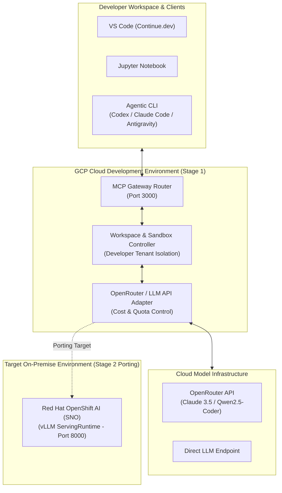

# 엔터프라이즈 코딩 에이전트 플랫폼 기본설계서 & 상세설계서 (아이디어 문서)

본 문서는 **구글 클라우드(GCP) 환경에서 개발을 시작하고, 향후 온프레미스(Red Hat OpenShift AI) 환경으로 이식(Porting)되는 엔터프라이즈 코딩 에이전트 플랫폼**의 아키텍처 기본설계서 및 상세설계서 백업본입니다.

---

## 1. 설계 개념 및 목적 (Design Concept & Objectives)

### 1.1 플랫폼 핵심 개발 목적
- **행사 시연 (10월 Red Hat Summit)**: 단 1대의 서버(Single Node OpenShift SNO) 위에서 보안 유출 없는 100% 온프레미스 코딩 에이전트의 라이브 시연.
- **사내 AI 기술력 홍보**: 퍼블릭 AI 대비 연간 60% 이상 비용 절감 및 100ms FIM(Fill-in-the-Middle) 타자 속도를 대시보드로 시각 증명.
- **오픈소스 생태계 기여**: 표준 MCP (Model Context Protocol) 게이트웨이 및 vLLM 어댑터를 커뮤니티에 공개하여 기술 파급력 확보.

### 1.2 대표 상용 솔루션 (Cursor, Claude Code) 대비 차별화 경쟁력
- **100% Air-Gapped On-Premise Native**: Cursor나 Claude Code 등 글로벌 TOP 솔루션이 제공하지 못하는 **단 1바이트의 유출도 없는 완전 폐쇄망 온프레미스 완결성**.
- **MCP 기반 IDE + CLI 통합 오케스트레이션**: VS Code(Continue.dev)와 Agentic CLI(Antigravity/Claude Code)를 단일 백엔드 MCP 라우터로 통합 제공.
- **GCP Cloud ➔ On-Premise 1-Click Portability**: 개발 시 GCP + OpenRouter API로 인프라 비용을 대폭 절감하고, 배포 시 1-Click으로 사내 OpenShift AI vLLM에 포팅되는 어댑터 아키텍처.

---

## 2. 아키텍처 기본 설계 (Basic System Architecture)

