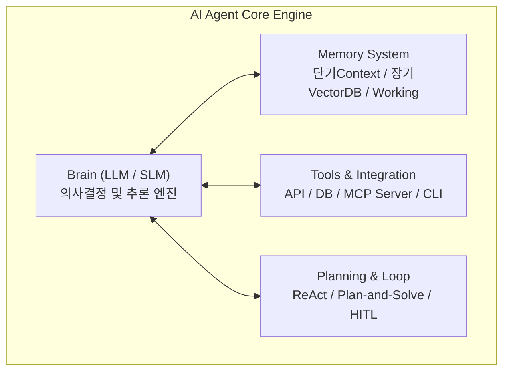

# AI Agent Builder 기술 조사 및 도입 가이드라인

본 문서는 **AI Agent Builder(AI 에이전트 빌더)**의 개념, 내부 4대 핵심 아키텍처 구조, 주요 개발 프레임워크/라이브러리(LangGraph, CrewAI, AutoGen 등), 그리고 2026년 기준 글로벌 시장 솔루션 맵을 정리한 전문 기술 가이드 문서입니다.

---

## 1. AI Agent Builder 개요 및 2026년 트렌드

### 1.1 AI Agent Builder란?
**AI Agent Builder**는 단순한 대화형 챗봇(Prompt-Response)을 넘어, **주어진 목표(Goal)를 달성하기 위해 스스로 계획을 수립(Planning)하고, 외부 도구(Tools/API/MCP)를 사용하며, 결과를 평가 및 보정하는 '자율형 AI 에이전트(Autonomous AI Agent)'를 구축·배포·운용하는 프레임워크 및 플랫폼**입니다.

### 1.2 2026년 시장 패러다임 변화
- **Agentic Workflows의 보편화**: 2026년 기준 대기업의 60% 이상이 최소 1개 이상의 에이전틱 워크플로우를 실무에 도입.
- **Model Context Protocol (MCP) 표준화**: Anthropic과 오픈소스 진영이 주도하는 MCP가 에이전트와 사내 도구/데이터 간의 연결 표준으로 정착.
- **Observability(관찰 가능성) & 거버넌스 필수화**: 단순 에이전트 생성을 넘어 에이전트의 수행 단계별 트레이싱(LangSmith, Phoenix) 및 사람의 승인(Human-in-the-loop) 제어가 필수로 자리잡음.

---

## 2. AI Agent 4대 핵심 아키텍처 구조

| 핵심 요소 | 주요 기능 및 역할 | 구현 기술 예시 |
| :--- | :--- | :--- |
| **Brain (추론 엔진)** | 목표 분석, 프롬프트 이해, 행동 결정 | GPT-4o, Claude 3.5, Qwen2.5-Coder, Llama 3 |
| **Memory (메모리)** | **단기**: Context Window **장기**: 과거 대화, Vector DB, Knowledge Graph **작업**: 멀티에이전트 공유 상태 | Qdrant, Milvus, Redis, Neo4j |
| **Tools (도구 연동)** | 외부 웹 검색, DB 쿼리, REST API, 로컬 코드 실행 | MCP (Model Context Protocol), Custom Python Tools |
| **Planning & Loop** | ReAct(Reason+Act), 서브태스크 분할, 사람 승인 게이트 | Directed Graph, State Machine, HITL |

---

## 3. 주요 개발 프레임워크 & 라이브러리 (Code-First Frameworks)

| 프레임워크 | 아키텍처 컨셉 | 주요 특징 및 장점 | 추천 적용 분야 |
| :--- | :--- | :--- | :--- |
| **LangGraph** *(LangChain)* | **방향성 그래프 (Directed Graph)** | **2026년 엔터프라이즈 프로덕션 표준 ⭐** 노드(Node)와 엣지(Edge) 기반의 세밀한 상태 관리, Time-travel 디버깅, 무한루프 제어. | 금융, 의료, 복잡한 비즈니스 로직 에이전트 |
| **CrewAI** | **역할 기반 (Role-Based)** | 사람이 일하는 조직 구조(역할, 목표, 백스토리)를 모방한 멀티에이전트 구축. 개발 속도 극대화. | 리서치, 마케팅/콘텐츠 생성, 보고서 작성 |
| **AutoGen** *(Microsoft)* | **대화형 루프** | 자율 에이전트 간 대화를 통한 코드 생성 및 자동 검증. | 코드 생성, 자동 소프트웨어 테스트 |
| **LlamaIndex Workflows** | **이벤트 기반 (Event-Driven)** | 대규모 RAG 및 데이터 연동 파이프라인 중심 이벤트 처리. | 엔터프라이즈 지식 RAG 에이전트 |
| **Semantic Kernel** *(MS)* | **엔터프라이즈 SDK** | C#, Python, Java 공식 지원. 기존 MS Azure/Enterprise 인프라 이식 우수. | 사내 ERP/CRM 연동 에이전트 |

---

## 4. 시장의 주요 AI Agent Builder 솔루션 맵 (Market Landscape)

### 4.1 Visual / No-Code / Low-Code 빌더
- **Dify**: RAG, LLM 선택, 워크플로우를 GUI 드래그 앤 드롭으로 작성하고 API로 즉시 배포하는 2026년 가장 인기 높은 오픈소스 플랫폼.
- **Flowise / Langflow**: LangChain/LangGraph 노드를 시각적으로 작성하는 인터페이스.
- **Coze (ByteDance)**: 다양한 툴과 DB를 결합하여 봇을 빠르게 배포하는 플랫폼.

### 4.2 Cloud Managed Enterprise Agent 플랫폼
- **Google Vertex AI Agent Builder**: Gemini 기반 기업 데이터(Drive, BigQuery) 권한 인지 에이전트 생성.
- **AWS Bedrock Agents**: AWS Lambda/S3와 연결하여 프라이빗 VPC 내에서 자율 실행.
- **Microsoft Copilot Studio**: Office 365, Teams, Power Platform 연동 사내 전용 빌더.
- **OpenAI Assistants API / GPTs**: Code Interpreter 및 File Search가 내장된 관리형 API.

---

## 5. 기술 선택 및 도입 가이드라인

1. **개발자 코딩 중심 (Code-First) & 고신뢰성 제어 필요 시**: 👉 **LangGraph** 선택
2. **역할 분담 기반 멀티에이전트 빠르게 구현 시**: 👉 **CrewAI** 선택
3. **비개발 부서와 현업이 드래그 앤 드롭으로 RAG 에이전트 구축 시**: 👉 **Dify** 선택
4. **온프레미스 보안 환경 구축 시**: 👉 **Red Hat OpenShift AI + LangGraph / vLLM** 조합 선택
