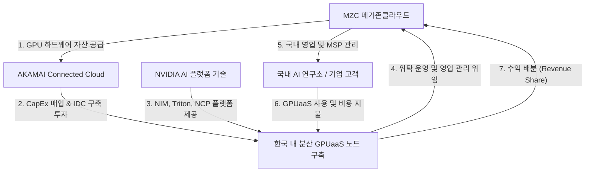

# AKAMAI & NVIDIA & MZC 한국형 GPUaaS 공동 사업 타당성 검토 프로젝트

본 프로젝트는 한국 시장 내 GPU 서버 수급의 한계를 극복하고, 저비용·고효율의 인공지능 추론 및 학습 환경을 제공하기 위한 **AKAMAI - NVIDIA - MZC(메가존클라우드) 공동 GPUaaS(GPU-as-a-Service) 사업 기획안**과 이에 대한 다차원적 타당성 검증(Feasibility Study) 보고서를 수립하는 워크스페이스입니다.

---

## 1. 사업 추진 배경 및 필요성

1. **국내 GPU 서버 확보 한계**: 글로벌 GPU 공급망 병목 및 규제 요인으로 인해 한국 내 기업들의 GPU 하드웨어 도입 리드타임이 수개월에서 1년 이상 지연되고 있습니다.
2. **비용 및 Egress 장벽**: 기존 대형 하이퍼스케일러(AWS, GCP, Azure)의 GPU 클라우드는 높은 사용료와 특히 거대한 데이터 전송 요금(Egress Fees)으로 인해 기업들의 AI 운영 TCO(총소유비용)를 급격히 상승시키고 있습니다.
3. **엣지 분산 AI 수요 증가**: 스마트 팩토리, 자율주행, 실시간 미디어 스트리밍 등 저지연 추론이 요구되는 분야가 급증함에 따라 중앙 집중식 AI 공장에서 분산 엣지 구조로의 패러다임 전환이 필요합니다.

---

## 2. 삼사(AKAMAI - NVIDIA - MZC) 파트너십 협력 구조

본 기획안은 **"아카마이의 자본력/글로벌 인프라 + 엔비디아의 AI 플랫폼 + MZC의 로컬 하드웨어 및 운영 역량"**을 결합한 하이브리드 위탁 운영 모델을 제안합니다.



### 파트너별 세부 역할:
*   **AKAMAI (투자 및 글로벌 인프라)**
    *   MZC가 기 확보한 GPU 하드웨어 장비를 일시 매입하여 초기 자본 투자(CapEx) 부담 완화.
    *   한국 내 코로케이션 IDC를 임차하여 Akamai Connected Cloud 전용 GPUaaS 엣지 노드로 편입.
    *   **요금 초강수 제안**: H100 시간당 **$2.50** (약 3,300원), L40S 시간당 **$1.10** (약 1,450원) 및 **초저가 Egress 요금($0.005/GB)** 적용 (국내 Naver/NHN의 시간당 7,000~8,000원대 GPU 요금 및 90~130원대 Egress 요금 대비 최소 50%~95%의 비용 절감 메리트 제공).
*   **NVIDIA (AI 솔루션 및 공급망)**
    *   NVIDIA Cloud Partner(NCP) 인증 및 DGX Cloud 레퍼런스 아키텍처 제공.
    *   NVIDIA NIM 및 Triton Inference Server 탑재를 통한 풀스택 AI 추론 파이프라인 소프트웨어 최적화 보장.
*   **MZC (장비 공급, 위탁 운영 및 영업)**
    *   글로벌 공급난 속에서 기 확보된 GPU 하드웨어 솔루션의 아카마이 매각 파이프라인 확보.
    *   한국 내 GPUaaS 인프라의 24/7 전문 위탁 운영(Ops) 및 기술 지원.
    *   국내 엔터프라이즈, AI 스타트업, 공공기관 대상 총판 영업 및 기술 컨설팅 수행.

---

## 3. 디렉토리 구조 및 산출물 안내

프로젝트 분석 문서와 타당성 시뮬레이션 자료는 아래 경로에 체계적으로 자산화됩니다.

```
akamai_ncp/
├── .agents/               # 에이전트 가이드라인 및 워크플로우 정의
│   ├── AGENTS.md          # AI 에이전트 전역 준수 규칙 (비즈니스 타당성 감사 기준)
│   └── skills/            # 기획 검토를 위한 전문 스킬 모음
├── docs/
│   ├── research/          # 아카마이-엔비디아 협력 분석 및 NCP 시장 분석 보고서
│   ├── proposal/          # MZC-아카마이 공동 사업 제안서
│   └── feasibility/       # 기술, 경제성(BEP 시뮬레이션 결과 포함), 보안 분석 보고서
├── scripts/
│   └── bep_simulation.py  # 가동률 및 비용 모델링용 파이썬 시뮬레이션 스크립트
└── CLAUDE.md              # 로컬 개발 및 실행 환경 가이드라인
```

---

## 4. 타당성 점검 마일스톤

본 워크스페이스는 다음과 같은 4단계 타당성 평가 프로세스를 거쳐 기획을 구체화합니다:
1. **기술 적합성**: LKE 및 가상화 노드 상에서의 NVIDIA AI 엔터프라이즈 성능 벤치마크 및 엣지 지연 시간 검증.
2. **비즈니스 및 경제성**: 파이썬 시뮬레이션을 활용한 투자 규모별 BEP(손익분기 가동률) 및 ROI 도출.
3. **시장성**: 하이퍼스케일러(AWS, GCP, Azure) 대비 가격 경쟁력 포지셔닝 분석.
4. **규제 및 보안**: 망분리, 개인정보보호법 및 데이터 주권 요건 검토.
