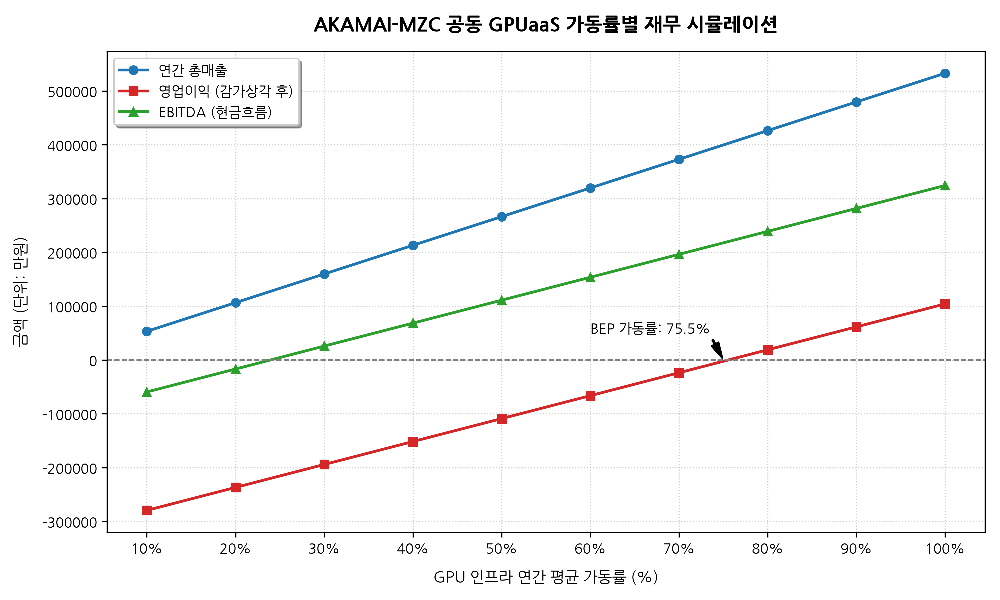

# AKAMAI-MZC 공동 GPUaaS 재무 타당성 및 손익분기점(BEP) 시뮬레이션 보고서

본 보고서는 아카마이(AKAMAI)가 메가존클라우드(MZC)의 GPU 하드웨어를 매입하여 국내에 GPUaaS 엣지 인프라를 구축하고, 이를 MZC에 위탁 운영 및 영업 대행을 맡겼을 때의 재무 타당성을 가동률별 시나리오에 따라 분석한 보고서입니다.

---

## 1. 재무 모델 및 가정 요약

시뮬레이션을 위한 초기 투자 비용(CapEx)과 연간 운영 비용(OpEx), 그리고 가격 및 매출 구조는 다음과 같습니다. (환율 기준: 1 USD = 1,320 KRW)

### 1.1. 초기 투자비 (CapEx) - 아카마이 전액 부담
- **하드웨어 매입비**: H100 (8-Way) HGX 서버 16대 (72억 원) + L40S (4-Way) 서버 32대 (32억 원) = 104억 원
- **IDC 초기 인프라 구축비**: 전력 배선 및 네트워크 백본망 구축비 = 6억 원
- **총 CapEx**: **110억 원** (5년 정액법 감가상각 적용, 잔존가치 0원. 연간 감가상각비 **22억 원**)

### 1.2. 연간 고정 운영비 (OpEx) - 아카마이 부담
- **IDC 상면 및 고전력 비용**: 연 4.2억 원 (월 3,500만 원)
- **100Gbps 네트워크 전용 회선료**: 연 1.8억 원 (월 1,500만 원)
- **MZC 위탁 운영 수수료 (Ops 전담 인력비)**: 연 3.0억 원 (월 2,500만 원)
- **로컬 영업/마케팅 및 일반 고정비**: 연 1.2억 원 (월 1,000만 원)
- **총 현금성 고정 OpEx**: **연간 10.2억 원** (월 약 8,500만 원)

### 1.3. 변동비 (Variable Cost)
- **MZC 영업 대행 수수료**: 발생 매출액의 **20%**를 MZC에 파트너 수수료(Revenue Share)로 지급.

### 1.4. 가격 정책 및 경쟁사 비교 요약 (가동률 100% 기준)
아카마이의 Egress 비용 강점과 결합하여 글로벌 하이퍼스케일러 및 국내 클라우드사 대비 약 40~60% 저렴한 단가를 제안합니다.

*   **H100 GPU 요금**: 시간당 **$2.50** (한화 약 3,300원) 책정
    *   *경쟁사 대비*: AWS/Azure/GCP ($4.30~$12.29) 및 네이버/NHN ($5.50~$8.00) 대비 **최소 40% ~ 70% 비용 절감**.
    *   16대 HGX 노드 연간 최대 매출: **약 37.0억 원**
*   **L40S GPU 요금**: 시간당 **$1.10** (한화 약 1,450원) 책정
    *   *경쟁사 대비*: AWS/GCP/Azure ($1.86~$2.50) 및 네이버/NHN ($2.10+) 대비 **최소 40% 이상 비용 절감**.
    *   32대 노드 연간 최대 매출: **약 16.3억 원**
*   **네트워크 Egress 비용**: 기가바이트(GB)당 **$0.005** 책정
    *   *경쟁사 대비*: 타사 (GB당 $0.07~$0.12) 대비 **16배 이상 저렴**.
*   **총 연간 최대 매출 한계**: **약 53.3억 원**

---

## 2. 가동률 시나리오별 손익 시뮬레이션 결과

파이썬 기반 재무 시뮬레이션 스크립트(`scripts/bep_simulation.py`)를 통해 도출된 가동률별 세부 영업 손익표는 다음과 같습니다. (단위: 만원)

| 연간 평균 가동률 (%) | 연간 총매출 | MZC 수수료 (20%) | 현금성 OpEx | 연간 감가상각비 | 영업이익 (감가상각 후) | EBITDA (현금성 흐름) |
| :---: | :---: | :---: | :---: | :---: | :---: | :---: |
| **10%** | 53,283 | 10,657 | 102,000 | 220,000 | -279,373 | -59,373 |
| **20%** | 106,566 | 21,313 | 102,000 | 220,000 | -236,747 | -16,747 |
| **30%** | 159,850 | 31,970 | 102,000 | 220,000 | -194,120 | 25,880 |
| **40%** | 213,133 | 42,627 | 102,000 | 220,000 | -151,494 | 68,506 |
| **50%** | 266,416 | 53,283 | 102,000 | 220,000 | -108,867 | 111,133 |
| **60%** | 319,699 | 63,940 | 102,000 | 220,000 | -66,241 | 153,759 |
| **70%** | 372,983 | 74,597 | 102,000 | 220,000 | -23,614 | 196,386 |
| **80%** | 426,266 | 85,253 | 102,000 | 220,000 | 19,013 | 239,013 |
| **90%** | 479,549 | 95,910 | 102,000 | 220,000 | 61,639 | 281,639 |
| **100%** | 532,832 | 106,566 | 102,000 | 220,000 | 104,266 | 324,266 |

---

## 3. 손익분기점(BEP) 및 투자 회수 기간 (ROI) 분석

### 3.1. 회계적 영업이익 기준 BEP: **75.54%**
*   초기 투자에 따른 연간 감가상각비(22억 원)가 매우 크기 때문에, 회계장부상 영업이익이 흑자로 전환하기 위한 임계 가동률은 **75.54%**입니다.
*   가동률 **80%**를 유지할 경우, 연간 약 **1억 9,000만 원**의 순영업이익이 발생하기 시작합니다.

### 3.2. 실질 현금흐름(EBITDA) 기준 BEP: **23.93%**
*   감가상각비는 비현금성 비용이므로, 실제 매월 나가는 IDC 비용 및 인건비를 감당하여 현금 누출이 멈추는 지점은 가동률 **23.93%**입니다.
*   **초기 생존 리스크 제로화**: MZC의 강력한 MSP 영업망을 통해 전체 GPU 인프라의 약 24%만 판매하더라도 월간 적자를 내지 않는 상태로 사업 영위가 가능합니다. 가동률 **30%** 도달 시 연간 **2,580만 원**의 현금이 누적되기 시작합니다.

### 3.3. 투자회수 기간 (ROI) 시뮬레이션
*   **가동률 80% 평균 유지 시**:
    *   연간 EBITDA(현금흐름) = 23.9억 원
    *   초기 투자금 110억 원 회수 기간 = **약 4.6년** ($\text{110억} \div \text{23.9억}$)
*   **가동률 90% 평균 유지 시**:
    *   연간 EBITDA(현금흐름) = 28.1억 원
    *   초기 투자금 110억 원 회수 기간 = **약 3.9년** ($\text{110억} \div \text{28.1억}$)

---

## 4. 재무적 총평 및 의사결정 제언

1.  **초기 안정성 확보**: EBITDA BEP 가동률이 23.93%로 매우 낮습니다. MZC의 기존 한국 내 클라우드 고객망(스타트업, 게임사, 커머스 등)에 아카마이의 강력한 가격 경쟁력(Egress 및 인스턴스 단가 50% 인하)을 패키징해 판촉한다면 수개월 이내에 현금흐름 흑자 전환이 확실시됩니다.
2.  **안정적인 CapEx 회수**: 가동률 80~90% 구간 안착 시 약 4년 내에 초기 투자금 110억 원 전액을 회수(EBITDA 기준)할 수 있으며, 감가상각 종료 이후에는 연간 25억 원 이상의 순수 현금 창출(EBITDA 마진율 약 50%)이 가능합니다.
3.  **결론**: 본 자산 매입 & MZC 위탁 운영 하이브리드 비즈니스 모델은 한국 내 GPU 품귀 현상을 신속히 비껴가면서도 양사 모두에 장기적이고 안정적인 캐시카우를 제공하는 고부가가치 사업 모델로 판정됩니다.
