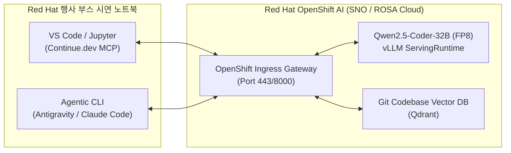
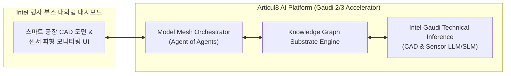

# 10월 Red Hat & 11월 Intel 행사 전시용 Pilot Solution 개발 계획서

본 문서는 **10월 Red Hat 행사(Red Hat Summit/Forum)** 및 **11월 Intel 행사(Intel AI Summit/Innovation)**에서의 부스 전시와 발표를 위해, 초저가 PoC 데모 Suit 또는 AWS/GCP 클라우드 연동 터미널 방식으로 즉시 시연 가능한 **Pilot Solution(시범 솔루션)**의 개발 계획 및 예산 산출서입니다.

---

## 1. 행사별 전시 솔루션 기획 개요

```
┌────────────────────────────────────────────────────────────────────────┐
│                        전시 행사 및 Pilot Solution                       │
├────────────────────────────────────┬───────────────────────────────────┤
│ 10월 Red Hat 행사 전용              │ 11월 Intel 행사 전용               │
│ "Red Hat OpenShift AI 코딩 에이전트"│ "Intel Gaudi & Articul8 예지보전"  │
│ - RHOAI (SNO) + Qwen2.5-Coder      │ - Intel Gaudi 2/3 + Articul8 AI   │
│ - MCP 기반 IDE & Agentic CLI 연동  │ - Model Mesh & CAD/센서 지식그래프│
└────────────────────────────────────┴───────────────────────────────────┘
```

---

## 2. [전시 1] 10월 Red Hat 행사 전용 Pilot Solution

### 2.1 제안 솔루션명: OpenShift AI 기반 엔터프라이즈 보안 코딩 에이전트
- **핵심 컨셉**: 100% Red Hat OpenShift AI (Single Node OpenShift SNO) 단일 노드 위에서 구동되는 사내 소스코드 유출 차단 완결형 코딩 에이전트.

### 2.2 솔루션 주요 특징 및 기능
- **RHOAI SNO 1노드 데모**: 별도 마스터 노드 없이 1대 서버에서 OpenShift K8s와 vLLM 서빙을 통합 구동하는 기술 시연.
- **MCP (Model Context Protocol) 멀티 클라이언트 연동**: VS Code(Continue.dev), Jupyter Notebook, 및 **Antigravity / Claude Code / Codex CLI**와의 MCP 연동.
- **FIM (Fill-in-the-Middle) 실시간 라인 완결**: `Tab` 키 조작 시 100ms 이내 실시간 코드 보완 및 사이드바 챗봇 대화.

### 2.3 시스템 사양 및 전시 구축 방식

| 구분 항목 | **옵션 A: 초저가 PoC Suit (부스 실물 랙 전시)** | **옵션 B: AWS ROSA 클라우드 + 부스 터미널 시연** |
| :--- | :--- | :--- |
| **인프라 방식** | Dell 2GPU 워크스테이션/서버 현장 실물 랙 배치 | AWS ROSA (Red Hat OpenShift on AWS) 인스턴스 |
| **하드웨어 사양** | 2x NVIDIA RTX 6000 Ada 48GB (VRAM 96GB) | AWS ROSA `g5.12xlarge` (4x A10G 24GB, VRAM 96GB) |
| **소프트웨어** | RHEL 9 + OpenShift AI SNO + Qwen2.5-Coder | ROSA + OpenShift AI + Qwen2.5-Coder |
| **소요 예산** | HW 구입 약 4,500만 원 (또는 장비 렌탈 약 400만 원) | **클라우드 데모비 약 350만 원 (1개월)** |

---

### 2.4 예상 아키텍처 구성도



---

### 2.5 MVP 개발 기간 및 추정 예산

- **MVP 개발 추정 기간**: **총 6주 (8월 18일 ~ 9월 26일)**
  - *1~2주차*: OpenShift AI SNO / ROSA 환경 구축 및 Qwen2.5-Coder vLLM 서빙
  - *3~4주차*: Continue.dev 및 Antigravity CLI MCP 게이트웨이 파이프라인 연동
  - *5~6주차*: 부스 데모 시나리오(FIM 라인 완성, 코드 리팩토링) 시뮬레이션 및 튜닝
- **추정 소요 예산**:
  - **개발 인건비**: 약 3,000만 원 (전문 엔지니어 2명 x 1.5개월)
  - **데모 인프라 비용**: 클라우드 인스턴스비 약 350만 원 (또는 장비 렌탈 400만 원)
  - **10월 행사 소요 예산 합계**: <span style="color:#00abf0; font-weight:bold;">**약 3,350만 원 ~ 3,400만 원**</span>

---

## 3. [전시 2] 11월 Intel 행사 전용 Pilot Solution

### 3.1 제안 솔루션명: Intel Gaudi & Articul8 기반 스마트 제조/플랜트 예지보전 AI
- **핵심 컨셉**: Intel 사내 GenAI 프로젝트 스핀오프인 **Articul8 AI Platform**과 **Intel Gaudi AI Accelerator**를 결합하여, 제조 도면(CAD) 해석 및 플랜트 센서 이상 감지를 시연하는 산업용 AI.

### 3.2 솔루션 주요 특징 및 기능
- **Model Mesh Orchestrator & Knowledge Graph**: 수동 라벨링 없이 CAD 도면 및 센서 수치 파형을 **자동 지식 그래프(Knowledge Graph)**로 구조화.
- **Intel Gaudi 2/3 초고속 추론 시연**: Intel Gaudi 가속기상에서의 실시간 도면 해석 및 센서 이상 예측 벤치마크 시연.

### 3.3 시스템 사양 및 전시 구축 방식

| 구분 항목 | **옵션 A: Intel Gaudi 온프레미스 노드 시연** | **옵션 B: AWS DL1 (Intel Gaudi) 클라우드 시연** |
| :--- | :--- | :--- |
| **인프라 방식** | Dell (8x Intel Gaudi 2/3) 온프레미스 서버 데모 | AWS DL1 (`dl1.24xlarge`, 8x Intel Gaudi 1/2) |
| **하드웨어 사양** | 8x Intel Gaudi 2 (768GB VRAM) + Intel Xeon | AWS DL1 (8x Gaudi 32GB = 256GB VRAM) |
| **소프트웨어** | RHEL + OpenShift AI + Articul8 Enterprise | AWS DL1 Ubuntu/RHEL + Articul8 Core |
| **소요 예산** | Intel 지원/데모 장비 활용 (HW비 0원) | **클라우드 데모비 약 400만 원 (1개월)** |

---

### 3.4 예상 아키텍처 구성도



---

### 3.5 MVP 개발 기간 및 추정 예산

- **MVP 개발 추정 기간**: **총 7주 (9월 8일 ~ 10월 24일)**
  - *1~2주차*: Intel Gaudi 환경 상 Articul8 AI 엔진 포팅 및 도면 데이터셋 가공
  - *3~5주차*: Knowledge Graph 자동 형성 파이프라인 및 센서 파형 이상 감지 모델 바인딩
  - *6~7주차*: 부스 시연용 터미널 및 웹 대시보드 인터페이스 튜닝
- **추정 소요 예산**:
  - **개발 인건비**: 약 3,000만 원 (전문 엔지니어 2명 x 1.5개월)
  - **데모 인프라 비용**: 클라우드 AWS DL1 약 400만 원 (또는 Intel 파트너 데모 장비 활용)
  - **11월 행사 소요 예산 합계**: <span style="color:#76b900; font-weight:bold;">**약 3,400만 원**</span>

---

## 4. [공통 옵션 전시] CS / ITSM Governed Support Agent

- **특징**: 행사 부스에서 즉석으로 사용자가 사내 ITSM(Jira/ServiceNow) 질의를 입력하면, 사원 직급별 접근 권한(Permission-aware RAG)을 검증하여 답변하고 승인권자 승인을 거치는 **Human-in-the-loop (HITL)** 시연.
- **추가 예산**: 기존 개발 파이프라인 상 모듈 추가 형태로 약 **500만 원** 내외로 시연 연동 가능.

---

## 5. 행사 준비 및 MVP 개발 종합 로드맵 (8월~11월)

```gantt
    title 10월 Red Hat & 11월 Intel 행사 전시 Pilot Solution 개발 일정
    dateFormat  YYYY-MM-DD
    section Red Hat 행사 데모
    RHOAI SNO & Qwen2.5-Coder 서빙 구축    :a1, 2026-08-18, 14d
    MCP (Continue.dev / Antigravity) 연동 :a2, after a1, 14d
    10월 행사 데모 튜닝 & 리허설          :a3, after a2, 14d
    10월 Red Hat 행사 부스 전시          :milestone, 2026-10-15, 2d
    section Intel 행사 데모
    Articul8 & Intel Gaudi 포팅          :b1, 2026-09-08, 21d
    Knowledge Graph & 도면 시연 UI 개발   :b2, after b1, 14d
    11월 행사 리허설 및 벤치마크 튜닝     :b3, after b2, 14d
    11월 Intel 행사 부스 전시            :milestone, 2026-11-18, 2d
```
